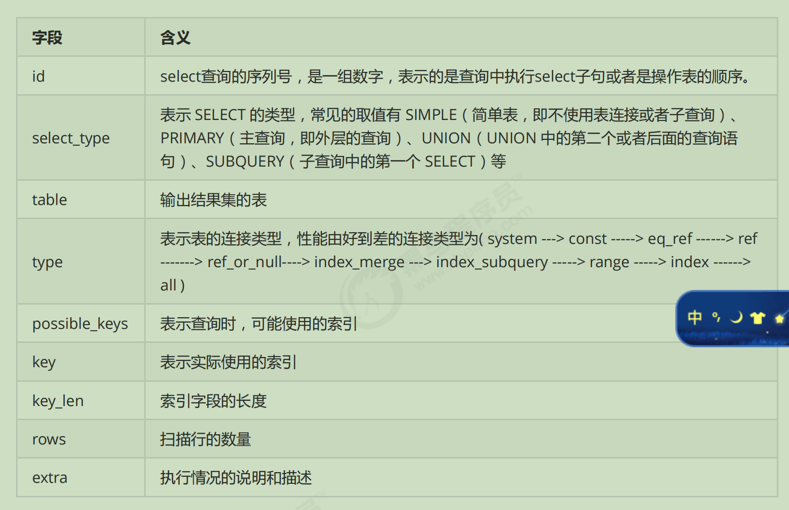
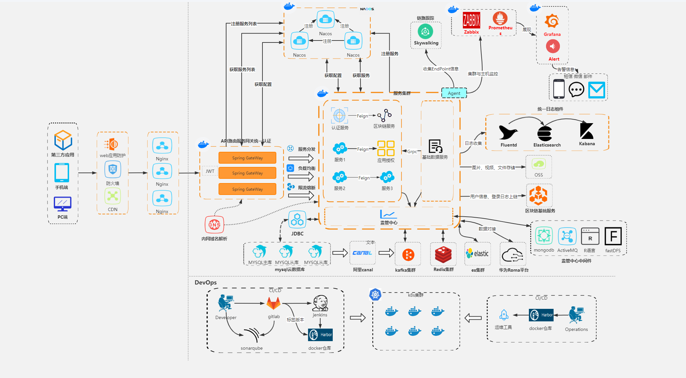
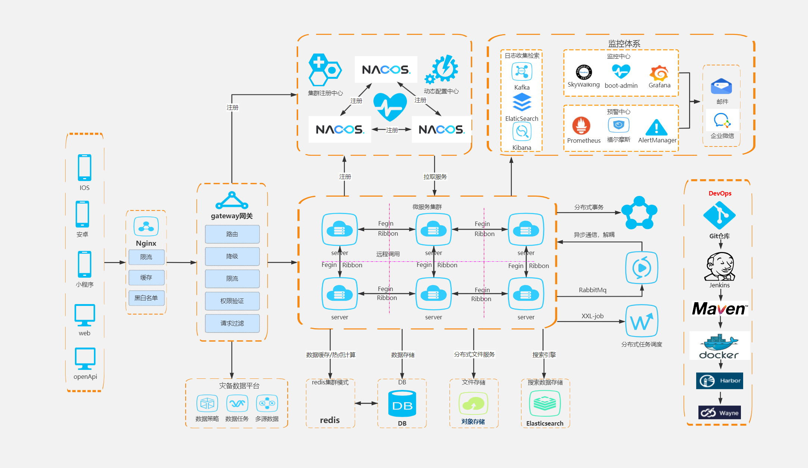
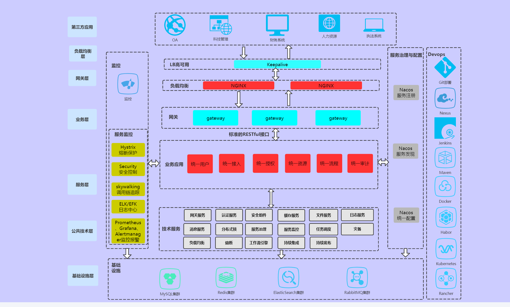
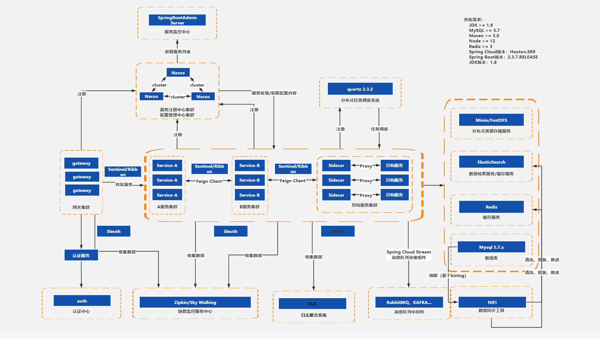
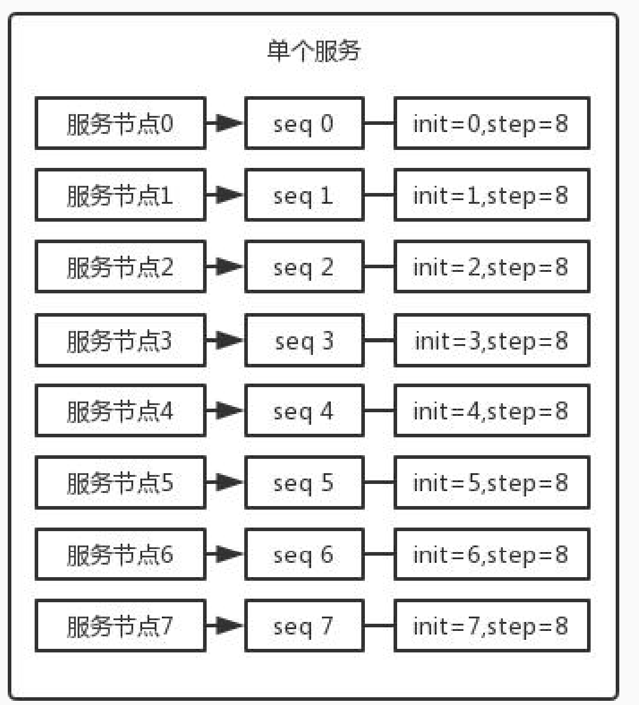
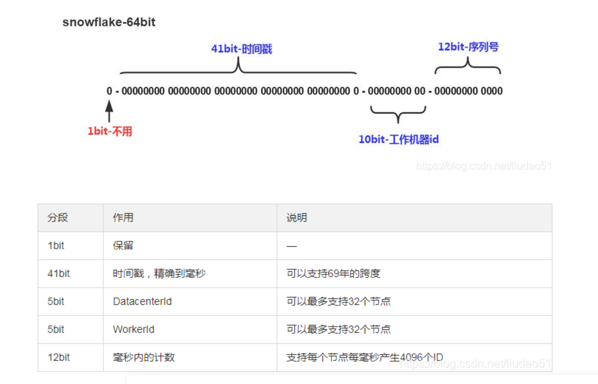
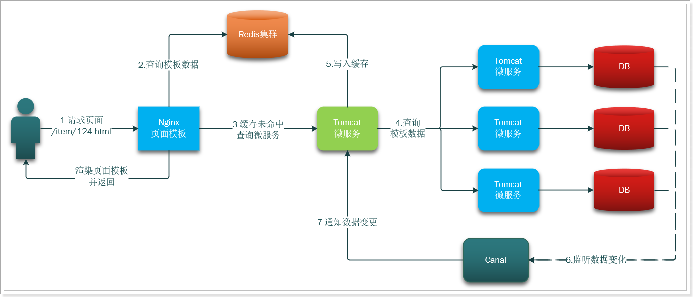

# **（所有链接仅为参考之一，后扩展延续，链接为通用方案，实际根据业务需要架构）**


# **Java基础**


## **多线程**AAAAAAAAAAAAA

### **1.创建多少线程合适**？【 参考链接：https://mp.weixin.qq.com/s?biz=Mzg5MzU2NDgyNw==&mid=2247487130&idx=1&sn=267e8f02170eaa7a4eb5d30f4ab6f72a&source=41#wechat_redirect】

1.创建多少线程合适**？【 参考链接：https://mp.weixin.qq.com/s?biz=Mzg5MzU2NDgyNw==&mid=2247487130&idx=1&sn=267e8f02170eaa7a4eb5d30f4ab6f72a&source=41#wechat_redirect】

1.创建多少线程合适**？【 参考链接：https://mp.weixin.qq.com/s?biz=Mzg5MzU2NDgyNw==&mid=2247487130&idx=1&sn=267e8f02170eaa7a4eb5d30f4ab6f72a&source=41#wechat_redirect】

1.创建多少线程合适**？【 参考链接：https://mp.weixin.qq.com/s?biz=Mzg5MzU2NDgyNw==&mid=2247487130&idx=1&sn=267e8f02170eaa7a4eb5d30f4ab6f72a&source=41#wechat_redirect】

1.创建多少线程合适**？【 参考链接：https://mp.weixin.qq.com/s?biz=Mzg5MzU2NDgyNw==&mid=2247487130&idx=1&sn=267e8f02170eaa7a4eb5d30f4ab6f72a&source=41#wechat_redirect】

1.创建多少线程合适**？【 参考链接：https://mp.weixin.qq.com/s?biz=Mzg5MzU2NDgyNw==&mid=2247487130&idx=1&sn=267e8f02170eaa7a4eb5d30f4ab6f72a&source=41#wechat_redirect】

1.创建多少线程合适**？【 参考链接：https://mp.weixin.qq.com/s?biz=Mzg5MzU2NDgyNw==&mid=2247487130&idx=1&sn=267e8f02170eaa7a4eb5d30f4ab6f72a&source=41#wechat_redirect】

1.创建多少线程合适**？【 参考链接：https://mp.weixin.qq.com/s?biz=Mzg5MzU2NDgyNw==&mid=2247487130&idx=1&sn=267e8f02170eaa7a4eb5d30f4ab6f72a&source=41#wechat_redirect】

1.创建多少线程合适**？【 参考链接：https://mp.weixin.qq.com/s?biz=Mzg5MzU2NDgyNw==&mid=2247487130&idx=1&sn=267e8f02170eaa7a4eb5d30f4ab6f72a&source=41#wechat_redirect】

1.创建多少线程合适**？【 参考链接：https://mp.weixin.qq.com/s?biz=Mzg5MzU2NDgyNw==&mid=2247487130&idx=1&sn=267e8f02170eaa7a4eb5d30f4ab6f72a&source=41#wechat_redirect】

1.创建多少线程合适**？【 参考链接：https://mp.weixin.qq.com/s?biz=Mzg5MzU2NDgyNw==&mid=2247487130&idx=1&sn=267e8f02170eaa7a4eb5d30f4ab6f72a&source=41#wechat_redirect】

1.创建多少线程合适**？【 参考链接：https://mp.weixin.qq.com/s?biz=Mzg5MzU2NDgyNw==&mid=2247487130&idx=1&sn=267e8f02170eaa7a4eb5d30f4ab6f72a&source=41#wechat_redirect】

1.创建多少线程合适**？【 参考链接：https://mp.weixin.qq.com/s?biz=Mzg5MzU2NDgyNw==&mid=2247487130&idx=1&sn=267e8f02170eaa7a4eb5d30f4ab6f72a&source=41#wechat_redirect】

- #### **分两种情况**：

  1. **CPU密集型程序（CPU计算多）**

     1. ##### CPU密集型程序程序需要CPU进行计算，程序运行中线程占用cpu时间较长

        **多核情况**：可以每个线程尽可能的分配一个cpu来运行任务会减少时间分片，线程切换

        **单核情况**：一个cpu运算多个线程任务会进行 时间分片线程上下文切换

     **总结：CPU密集型程序多核的情况多线程编程可以最大化利用系统资源**

     ```text
     业内结论：创建的线程数最好为CPU逻辑核心数+1
     （多出一条线程为了防止一些特殊情况导致线程发生页错误或暂停，保证任务执行不终止）
     ```

  2. **IO密集型程序（线程IO操作占用时间多）**

     1. 线程IO操作cpu会空闲下来，此时空闲cpu可以去执行其他线程任务

     ```
     业内结论：IO密集型程序创建线程数业内（CPU利用率=IO耗时/CPU耗时）最佳线程数 = CPU核心数 *  (1/CPU利用率) =  CPU核心数 * 1 + (IO耗时/CPU耗时)
     ```

     1. **IO密集型程序 如果实在不清楚cpu，io耗时数据，创建线程数可以为核心线程数的两倍**

     

     ```
     我怎么知道具体的 I/O耗时和CPU耗时呢？
     怎么查看CPU利用率？
     
     可以根据服务链路追踪工具查看资源耗时：
     SkyWalking
     CAT
     zipkin
     
     ```

最后：**CPU核心数并不一定能代表程序的运行性能，**因为程序在临界区运行时（如加锁区域）是串行的，需要根据实际运用技术加上良好的编程习惯进行优化

**阿姆达尔定律公式：**

```text
S = 1/[(1-p)+(p/n)] 
n:cup核数，
p:程序并行百分比，
1-p:程序串行百分比

比如如果我们的代码串行率为5%,带入公式S结果为20，这个场景结果表明再如何优化，性能最高无限接近20倍
```

## **集合容器**

### 集合框架图


### [Java集合](https://so.csdn.net/so/search?q=Java集合&spm=1001.2101.3001.7020)体系框架总结：【https://blog.csdn.net/m0_67322837/article/details/124322953】


### Hashset底层源码分析【https://www.jianshu.com/p/6cab0fae2403！】

底层Hashmap, key作为添加的值，value全部是persent

### **集合全解**

（掘金小伙）https://juejin.cn/post/6844904105891069965

https://www.jianshu.com/p/0b23cc00cca6/

### 补充【equals、==、intern () 之间的区别 https://my.oschina.net/WEguo/blog/1538853】


## Arraylist,LinkList时间复杂度问题

### **1. 头部插入（删除）、中部插入（删除）、尾部插入（删除）实验**(**一千万元素实验**)

https://blog.csdn.net/A_captain_608/article/details/127205351

#### 实验结果：

> (1). LinkedList和ArrayList在一千万个元素中随机查询，可以看到ArrayList相对LinkedList快很多。（ArrayList有下标）根据下标随机获取值时间复杂度为O(1)
>
> (2). 在尾部删除，ArrayList不需要移动元素，LinkedList只需要删除尾部指针，因此两者耗时相近。(O(1)级别时间复杂度)
>
> (3). 在尾部删除，ArrayList不需要移动元素，LinkedList只需要删除尾部指针，因此两者耗时相近。(O(1)级别时间复杂度)
>
> (4).头部插入与头部删除一样，ArrayList同样需要移动近一千万的元素，而LinkedList只需要删除头部的指针即可。LinkedList比ArrayList快。
>
> **(5).在中部插入与删除类似，LinkedList的遍历速度没有ArrayList移动元素的速度快。ArrayList比LinkedList快。** 
>
> （**多数场景-综合选型：要随机也就是根据下标来查询多的话就用ArrayList，插入的话，要是频繁插入多，就用LinkedList，涉及扩容的情况(在ArrayList任意位置插入或者删除元素时，就需要将后序元素整体往前或者往后搬移，时间复杂度为O(n)，效率比较低，因此ArrayList不适合做任意位置插入和删除比较多的场景，更别说涉及扩容机制耗时**）
>
> 扩容因子：（https://baijiahao.baidu.com/s?id=1742659763306352727&wfr=spider&for=pc）
>
> (6).尾部插入与尾部删除类似，LinkedList不需要遍历，ArrayList不需要移动元素，因此两者效率相近
>
> 

#### 总结：通过以上验证可知并不是所有的插入、删除，LinkedList都要比ArrayList快，要看数据量，要根据具体插入、删除的位置而定。 

## 严谨对比ArrayList与Linklist

https://blog.csdn.net/qq_61862008/article/details/127931780（此链接最后描述的扩容因子不详细，参考上面的连接）


## ArrayList为什么移动元素的速度那么快？

## 

## ArrayList  与Linklist 访问速度

ArrayList  访问速度快不单单因为其是内存连续的原因，它带下标还实现了 RandomAccess接口，它是一个标记接口，用以标记实现的List集合具备快速随机访问的能力。

当一个List拥有快速访问功能时，其遍历方法采用for循环最快速。而没有快速访问功能的List，遍历的时候采用Iterator迭代器最快速。

当我们不明确获取到的是Arraylist，还是LinkedList的时候，我们可以通过RandomAccess来判断其是否支持快速随机访问，若支持则采用for循环遍历，否则采用迭代器遍历

https://www.cnblogs.com/V1haoge/p/10755424.html (RandomAccess)


## Java反射原理，我刚好都会

https://blog.csdn.net/JAck_chen0309/article/details/105427350


## **Comparable与**Comparato的区别****

https://www.cnblogs.com/stamp/p/java_base.html

JUC 之

# netty (推荐参考P9)


# **spring**

## 一、IOC启动(初始化)流程三步:  1.资源定位、2、资源载入、3、bean注册

1、**资源定位** 首先从ioc容器的大致的创建流程,其分为屌丝容器(原始如XmlBeanFactory) 和高富帅容器Applicationcontext, **[beanfactory是spring IOC的核心 ,属心脏部分,具备ioc容器的主干功能,ApplicationContext 是IOC的完全体,  具备功能如:**

**1. 支持信息源，可以实现国际化。（实现MessageSource接口）**

**2.访问资源。(实现ResourcePatternResolver接口，这个后面要讲)**

**3.支持应用事件。(实现ApplicationEventPublisher接口)** **]**

A-: 屌丝XmlBeanFactor  资源定位创建如下: 

```java
/根据Xml配置文件创建Resource资源对象，该对象中包含了BeanDefinition的信息
ClassPathResource resource =new ClassPathResource("application-context.xml");
//创建DefaultListableBeanFactory
DefaultListableBeanFactory factory =new DefaultListableBeanFactory();
//创建XmlBeanDefinitionReader读取器，用于载入BeanDefinition。之所以需要BeanFactory作为
参数，是因为会将读取的信息回调配置给factory
XmlBeanDefinitionReader reader =new XmlBeanDefinitionReader(factory);
//XmlBeanDefinitionReader执行载入BeanDefinition的方法，最后会完成Bean的载入和注册。完成
后Bean就成功的放置到IOC容器当中，以后我们就可以从中取得Bean来使用
reader.loadBeanDefinitions(resource);

============================================
通过XmlBeanFactory的源码，我们可以发现:

public class XmlBeanFactory extends DefaultListableBeanFactory{
private final XmlBeanDefinitionReader reader;
public XmlBeanFactory(Resource resource)throws BeansException{
this(resource, null);
}
public XmlBeanFactory(Resource resource, BeanFactory parentBeanFactory)
throws BeansException{
super(parentBeanFactory);
this.reader = new XmlBeanDefinitionReader(this);
this.reader.loadBeanDefinitions(resource);
}
}
通过前面的源码，this.reader = new XmlBeanDefinitionReader(this); 中其中this 传的是factory对象


```

B-:高级容器ApplicationContext =new FileSystemXmlApplicationContext(xmlPath);

**2.进行资源加载器和资源定位**,

a. 通过FileSystemXmlApplicationContext类中super(parent)方法调用其父类AbstractApplicationContext构造为容器设置好bean的加载器,

**(AbstractApplicationContext构造方法中调用PathMatchingResourcePatternResolver的构造方法创建Spring资源加载器 如下代码：)**

```java
public FileSystemXmlApplicationContext(String[] configLocations, boolean refresh,
ApplicationContext parent)
throws BeansException {、
    
//调用父类构造设置bean的加载器
super(parent);
                       
setConfigLocations(configLocations);
    if (refresh) {
    refresh();
	}
}

-------------------------------------------------------------------------------------
//  FileSystemXmlApplicationContext 的父类源码
public abstract class AbstractApplicationContext extends DefaultResourceLoader
implements ConfigurableApplicationContext, DisposableBean {

	...
	//FileSystemXmlApplicationContext调用父类构造方法调用的就是该方法
    public AbstractApplicationContext(ApplicationContext parent) {
        this.parent = parent;
        this.resourcePatternResolver = getResourcePatternResolver();
    }
	
    //获取一个Spring Source的加载器用于读入Spring Bean定义资源文件
    protected ResourcePatternResolver getResourcePatternResolver() {
        // AbstractApplicationContext继承DefaultResourceLoader，也是一个S
        //Spring资源加载器，其getResource(String location)方法用于载入资源
        return new PathMatchingResourcePatternResolver(this);
    }


}


												   
```


---容器的资源加载器设置完成之后---,

 	 **FileSystemXmlApplicationContet执行setConfigLocation（）方法** 调用其父类AbstractRefreshableConfigApplicationContext的方法setConfigLocation(configLocations)   **设置   Bean定义资源文件的定位路径。**

```java
两种方式:
/处理单个资源文件路径为一个字符串的情况
public void setConfigLocation(String location){
//即多个资源文件路径之间用” ,; /t/n”分隔，解析成数组形式
setConfigLocations(StringUtils.tokenizeToStringArray(location,
CONFIG_LOCATION_DELIMITERS))
}
    
//解析Bean定义资源文件的路径，处理多个资源文件字符串数组
 public void setConfigLocations(String[] locations) {
     ....
 }
```

**3、AbstractApplicationContext的refresh函数载入Bean定义过程：**

载入从 refresh()函数开始的，refresh()是一个模板方法，refresh()
方法的作用是：在创建IoC容器前，如果已经有容器存在，则需要把已有的容器销毁和关闭，以保证在refresh之后使用的是新建立起来的IoC容器。refresh的作用类似于对IoC容器的重启，在新建立好的容器中对容器进行初始化，对Bean定义资源进行载入

**FileSystemXmlApplicationContext通过调用其父类AbstractApplicationContext的refresh()**函数启动整个IoC容器对Bean定义的载入过程：

并且refresh()方法主要为IOC容器的生命周期管理提供条件**,Spring IoC容器载入Bean定义资源文件从其子类容器的refreshBeanFactory()方法启动,**

通过 refresh()中调用“ConfigurableListableBeanFactory
beanFactory =obtainFreshBeanFactory()**[/告诉子类启动refreshBeanFactory()方法，进行Bean定义资源文件的载入]**

**[ FileSystemXmlApplicationContext 的父类AbstractApplicationContext refresh()方法如下 ]:**

```java


public void refresh() throws BeansException, IllegalStateException {
    
 //调用容器准备刷新的方法，获取容器的当时时间，同时给容器设置同步标识
prepareRefresh();
    
//告诉子类启动refreshBeanFactory()方法，Bean定义资源文件的载入子类的refreshBeanFactory()方法启动
ConfigurableListableBeanFactory beanFactory =
obtainFreshBeanFactory();
    
//为BeanFactory配置容器特性，例如类加载器、事件处理器等
prepareBeanFactory(beanFactory);
    
    
    
    
    try {
11 //为容器的某些子类指定特殊的BeanPost事件处理器
12 postProcessBeanFactory(beanFactory);
13 //调用所有注册的BeanFactoryPostProcessor的Bean
14 invokeBeanFactoryPostProcessors(beanFactory);
15 //为BeanFactory注册BeanPost事件处理器.
16 //BeanPostProcessor是Bean后置处理器，用于监听容器触发的事件
17 registerBeanPostProcessors(beanFactory);
18 //初始化信息源，和国际化相关.
19 initMessageSource();
 
refresh()方法主要为IoC容器Bean的生命周期管理提供条件，Spring IoC容器载入Bean定义资源文件从
其子类容器的refreshBeanFactory()方法启动，所以整个refresh()中“ConfigurableListableBeanFactory
beanFactory =obtainFreshBeanFactory();”这句以后代码的都是注册容器的信息源和生命周期事件，载
入过程就是从这句代码启动。
 refresh()方法的作用是：在创建IoC容器前，如果已经有容器存在，则需要把已有的容器销毁和关闭，
以保证在refresh之后使用的是新建立起来的IoC容器。refresh的作用类似于对IoC容器的重启，在新建
立好的容器中对容器进行初始化，对Bean定义资源进行载入
AbstractApplicationContext的obtainFreshBeanFactory()方法调用子类容器的refreshBeanFactory()方
法，启动容器载入Bean定义资源文件的过程，代码如下：
 
AbstractApplicationContext子类的refreshBeanFactory()方法：
20 //初始化容器事件传播器.
21 initApplicationEventMulticaster();
22 //调用子类的某些特殊Bean初始化方法
23 onRefresh();
24 //为事件传播器注册事件监听器.
25 registerListeners();
26 //初始化所有剩余的单态Bean.
27 finishBeanFactoryInitialization(beanFactory);
28 //初始化容器的生命周期事件处理器，并发布容器的生命周期事件
29 finishRefresh();
30 }
31 catch (BeansException ex) {
32 //销毁以创建的单态Bean
33 destroyBeans();
34 //取消refresh操作，重置容器的同步标识.
35 cancelRefresh(ex);
36 throw ex;
37 }

}


```


```java
protected ConfigurableListableBeanFactory obtainFreshBeanFactory() {
//这里使用了委派设计模式，父类定义了抽象的refreshBeanFactory()方法，具体实现调用子
类容器的refreshBeanFactory()方法
refreshBeanFactory();
ConfigurableListableBeanFactory beanFactory = getBeanFactory();
if (logger.isDebugEnabled()) {
logger.debug("Bean factory for " + getDisplayName() + ": " +
beanFactory);
}
return beanFactory;
}

```


”这句以后代码的都是注册容器的信息源和生命周期事件，载入过程就是从这句代码启动。

**[AbstractApplicationContext的obtainFreshBeanFactory()方法调用子类容器AbstractRefreshableApplicationContext 的 refreshBeanFactory()方法，启动容器载入Bean定义资源文件]:** 

**在调用的refreshBeanFactory方法中，先判断BeanFactory是否存在，如果存在则先销毁beans并关闭beanFactory，**

**4、接着创建DefaultListableBeanFactory，并调用loadBeanDefinitions(beanFactory)装载bean定义。[代码如下:]**

```java
AbstractApplicationContext().obtainFreshBeanFactory().refreshBeanFactory()
	-AbstractRefreshableApplicationContext().refreshBeanFactory(

public  class AbstractRefreshableApplicationContext extends AbstractApplicationContext{

    
        protected ConfigurableListableBeanFactory obtainFreshBeanFactory() {e

        //这里使用了委派设计模式，父类定义了抽象的refreshBeanFactory()方法，具体实现调用子
        类容器的refreshBeanFactory()方法
        refreshBeanFactory(); //调用下面方法
        ConfigurableListableBeanFactory beanFactory = getBeanFactory();

        ........
        return beanFactory;
        }

    
//在这个方法中，先判断BeanFactory是否存在，如果存在则先销毁beans并关闭beanFactory，接着创建
//DefaultListableBeanFactory，并调用loadBeanDefinitions(beanFactory)装载bean定义。
	protected final void refreshBeanFactory() throws BeansException {
		if (hasBeanFactory()) {//如果已经有容器，销毁容器中的bean，关闭容器
		destroyBeans();
	 	closeBeanFactory();

		}
        try{
            
		DefaultListableBeanFactory beanFactory = createBeanFactory();
			...
		loadBeanDefinitions(beanFactory); //bstractRefreshableApplicationContext子类方法
			...
        }catch{
            
            ...
        }

    }
    
    
}


```

extends

 **5、{AbstractRefreshableApplicationContext中只定义了抽象的loadBeanDefinitions方法（loadBeanDefinitions是抽象方法），容器真正调用
的是其子类AbstractXmlApplicationContext对该方法的实现，AbstractXmlApplicationContext的主要
源码如下：}**

{AbstractXmlApplicationContext的
祖先父类AbstractApplicationContext继承DefaultResourceLoader，因此，容器本身也是一个资源加载器}

```java
AbstractXmlApplicationContext extends AbstractRefreshableApplicationContext ... (...){
    
    //实现父类抽象的载入Bean定义方法
	@Override
	protected void loadBeanDefinitions(DefaultListableBeanFactory beanFactory)throws BeansException, IOException {
//创建XmlBeanDefinitionReader，即创建Bean读取器，并通过回调设置到容器中去，容器使用该读取器读取Bean定义资源
XmlBeanDefinitionReader beanDefinitionReader = new XmlBeanDefinitionReader(beanFactory);
        ...
//Bean读取器真正实现加载的方法
loadBeanDefinitions(beanDefinitionReader);

            
}
//Xml Bean读取器加载Bean定义资源
protected void loadBeanDefinitions(XmlBeanDefinitionReader reader) throws
		BeansException, IOException  }
		//获取Bean定义资源的定位
         Resource[] configResources = getConfigResources();
		if (configResources != null) {
		//Xml Bean读取器调用其父类AbstractBeanDefinitionReader读取定位
		//的Bean定义资源
		reader.loadBeanDefinitions(configResources);
		}
         
     
         ...
	//如果子类中获取的Bean定义资源定位为空，则获取FileSystemXmlApplicationContext 构造方法中  吗    setConfigLocations方法设置的资源
	String[] configLocations = getConfigLocations();
	if (configLocations != null) {
	//Xml Bean读取器调用其父类AbstractBeanDefinitionReader读取定位
	//的Bean定义资源
	reader.loadBeanDefinitions(configLocations);
        ...
}

    
}

	
```

**a方式:而用FileSystemXmlApplicationContext定义的资源为例getConfigLocations为null   用下面分支 String[] configLocations = getConfigLocations();**

程序执行reader.loadBeanDefinitions(configLocations)分支进行资源定位加载。

b方式：Resource[] configResources = **getConfigResources();** 调用其父类AbstractBeanDefinitionReader的
**reader.loadBeanDefinitions方法载入Bean定义资源分析如下:** 


**6、AbstractBeanDefinitionReader读取Bean定义资源：**


> ***BeanDefinitionReader*结构:**
>
> BeanDefinitionReader
>
> ​	-AbstractBeanDefinitionReader
>
> ​		- PropertiesBeanDefinitionReader
>
> ​		-XmlBeanDefinitionReadr


大体上**AbstractBeanDefinitionReader**的loadBeanDefinitions方法源码分析可以看出该方法做了以下两件
事：

**A: 加载器resourceLoader.getResource(location)，获取到要加载的资源**

**B:	真正加载是AbstractBeanDefinitionReader委派调用其子类XmlBeanDefinitionReader的方法，实现加载功能**
		int loadCount = loadBeanDefinitions(resource);

​	在其抽象父类AbstractBeanDefinitionReader的loadBeanDefinitions**方法（为抽象方法由其子类XmlBeanDefinitionReader调用）源码如下**：

```java
//重载方法，调用下面的loadBeanDefinitions(String, Set<Resource>);方法
public int loadBeanDefinitions(String location) throws
BeanDefinitionStoreException {
    
	return loadBeanDefinitions(location, null);

public int loadBeanDefinitions(String location, Set<Resource>
actualResources) throws BeanDefinitionStoreException {
    //获取在IoC容器初始化过程中设置的资源加载器
    ResourceLoader resourceLoader = getResourceLoader();
    
    if(...){
        ...
          //将指定位置的Bean定义资源文件解析为Spring IoC容器封装的资源
		 //加载多个指定位置的Bean定义资源文件
		Resource[] resources = ((ResourcePatternResolver)
		resourceLoader).getResources(location);
		//委派调用其子类XmlBeanDefinitionReader的方法，实现加载功能
		 int loadCount = loadBeanDefinitions(resources);
        
    }else(){
        //将指定位置的Bean定义资源文件解析为Spring IoC容器封装的资源
		//加载单个指定位置的Bean定义资源文件
        Resource resource = resourceLoader.getResource(location);
		//委派调用其子类XmlBeanDefinitionReader的方法，实现加载功能
		int loadCount = loadBeanDefinitions(resource);
        
    }

    ...
}


```

**7、资源加载器获取要读入的资源：**

**上面代码 getResource为DefaultResourceLoader的方法**

 从 **类继承关系中ApplicationContext和FileSystemXmlApplicationContext同样为DefaultResourceLoader的子类所以此时又回到了   FileSystemXmlApplicationContext中来定位资源。**

```java
public Resource getResource(String location) {

    if(...){
        //如果是类路径的方式，那需要使用ClassPathResource 来得到bean 文件的资源对象
		ClassPathResource(location.substring(CLASSPATH_URL_PREFIX.length()),
		getClassLoader());
    }
    try{
        // 如果是URL 方式，使用UrlResource 作为bean 文件的资源对象
        URL url = new URL(location);
		return new UrlResource(url);
    }catch(...){
        ...
    }
    	
        //如果既不是classpath标识，又不是URL标识的Resource定位，则调用
        //容器本身的getResourceByPath方法获取Resource 
    // FileSystemXmlApplicationContext容器提供了getResourceByPath方法的实现
        return getResourceByPath(location); 
    
}

class FileSystemXmlApplicationContext(...){
    
    protected Resource getResourceByPath(String path) {
    if (path != null && path.startsWith("/")) {
    path = path.substring(1);
    }
    //这里使用文件系统资源对象来定义bean 文件
    return new FileSystemResource(path);
    }	
   
}


```

**回到 FileSystemXmlApplicationContext 中来，它提供了FileSystemResource（path）返回资源Resoure定义**

 来完成从文件系统得到配置文件的资源定义，从而可以从文件系统上加载IOC配置文件

**8、接着继续XmlBeanDefinitionReader.loadBeanDefinitions(Resoure) 进行载入Bean的资源定义**

```java
//XmlBeanDefinitionReader加载资源的入口方法
public int loadBeanDefinitions(Resource resource) throws BeanDefinitionStoreException {
	//将读入的XML资源进行特殊编码处理
	return loadBeanDefinitions(new EncodedResource(resource));
}
//这里是载入XML形式Bean定义资源文件方法
public int loadBeanDefinitions(EncodedResource encodedResource) throws
BeanDefinitionStoreException {
    //将资源文件转为InputStream的IO流
	InputStream inputStream =
encodedResource.getResource().getInputStream();
    try{
        
//从InputStream中得到XML的解析源
InputSource inputSource = new InputSource(inputStream);
if (encodedResource.getEncoding() != null) {
inputSource.setEncoding(encodedResource.getEncoding());
}
		//这里是具体的读取过程
		return doLoadBeanDefinitions(inputSource,
		encodedResource.getResource());
        
    }catch(...){
        
    }

    
}
//从特定XML文件中实际载入Bean定义资源的方法
protected int doLoadBeanDefinitions(InputSource inputSource, Resource
resource){
	...
try {
int validationMode = getValidationModeForResource(resource);
//将XML文件转换为DOM对象，解析过程由documentLoader实现
Document doc = 
this.documentLoader.loadDocument(
inputSource, this.entityResolver, this.errorHandler,
validationMode, this.namespaceAware);

//通过源码分析，载入Bean定义资源文件的最后一步是将Bean定义资源转换为Document对象，该过程由documentLoader实现
// DocumentLoader将Bean定义资源转换为Document对象：
// DocumentLoader将Bean定义资源转换成Document对象的源码如下：
//这里是启动对Bean定义解析的详细过程，该解析过程会用到Spring的Bean配置规则
	return registerBeanDefinitions(doc, resource);
}

}

```


**上面代码中XmlBeanDefinitionReader.loadBeanDefinitions（...）方法中将FileSystemXmlApplicationContext定义的资源resource 文件由该过程由loadBeanDefinitions方法内部调用doLoadBeanDefinitions方法  再经过documentLoader.loadDocument(...)实现转换成Document对象**

**9、DocumentLoader将Bean定义资源转换为Document对象：代码如下**

```java
//使用标准的JAXP将载入的Bean定义资源转换成document对象
public Document loadDocument(InputSource inputSource, EntityResolver
    entityResolver, ErrorHandler errorHandler, int validationMode, boolean
    namespaceAware) throws Exception {

//创建文件解析器工厂
DocumentBuilderFactory factory =
createDocumentBuilderFactory(validationMode, namespaceAware);
....
//创建文档解析器
 DocumentBuilder builder = createDocumentBuilder(factory,
entityResolver, errorHandler);
 //创建文档解析器
 DocumentBuilder builder = createDocumentBuilder(factory,
entityResolver, errorHandler);
//解析Spring的Bean定义资源 解析成doc文件
return builder.parse(inputSource);

}

protected DocumentBuilderFactory createDocumentBuilderFactory(int
validationMode, boolean namespaceAware){
//创建文档解析工厂
 DocumentBuilderFactory factory = DocumentBuilderFactory.newInstance();
 //设置解析XML的校验
factory.setNamespaceAware(namespaceAware);

...
return factory;

}
```


**至此Spring IoC容器根据定位的Bean定义资源文件，将其加载读入并转换成为Document对象过程完成。**  

### 定位--->载入--->载入后转换成Document对象

**

**10、XmlBeanDefinitionReader解析载入的Bean定义资源文件：**

XmlBeanDefinitionReader类中的doLoadBeanDefinitions方法是从特定XML文件中实际载入Bean定义资源的方法，该方法在载入Bean定义资源之后将其转换为Document对象，

**接下来registerBeanDefinitions(doc, resource)准备将Document中的Bean**
**按照Spring bean语义进行解析并转化为BeanDefinition类型，**

**registerBeanDefinitions启动Spring IoC容器对Bean定义的解析过程，registerBeanDefinitions方法源码如下：**


```java
//按照Spring的Bean语义要求将Bean定义资源解析并转换为容器内部数据结构
public int registerBeanDefinitions(Document doc, Resource resource) throws
BeanDefinitionStoreException {
    //得到BeanDefinitionDocumentReader来对xml格式的BeanDefinition解析
    BeanDefinitionDocumentReader documentReader =createBeanDefinitionDocumentReader();
    /获得容器中注册的Bean数量
 	int countBefore = getRegistry().getBeanDefinitionCount();
     //解析过程入口，这里使用了委派模式，BeanDefinitionDocumentReader只是个接口，//具
    体的解析实现过程有实现类DefaultBeanDefinitionDocumentReader完成
    documentReader.registerBeanDefinitions(doc,
    createReaderContext(resource));
	//统计解析的Bean数量
	 return getRegistry().getBeanDefinitionCount() - countBefore;
    
}


protected BeanDefinitionDocumentReader createBeanDefinitionDocumentReader()
    {
    return BeanDefinitionDocumentReader.class.cast(BeanUtils.instantiateClass(this.document
    ReaderClass));
}

```

首先：之前通过调用XML解析器将Bean定义资源文件转换得到Document对象，但是这些Document对象并没有按照Spring的Bean规则进行解析需要进一步处理

其次：从上面代码中看出 按照Spring的Bean规则对Document对象解析的过程是在接口**BeanDefinitionDocumentReader的实现类DefaultBeanDefinitionDocumentReader中实现的。**

 **上面代码通过 XmlBeanDefinitionReader 类中的私有属性 documentReaderClass 可以获得一个DefaultBeanDefinitionDocumentReader 实例对象**

**11、BeanDefinitionDocumentReader接口通过registerBeanDefinitions方法调用其实现类
DefaultBeanDefinitionDocumentReader对Document对象进行解析，解析的代码如下：**

```java
//根据Spring DTD对Bean的定义规则解析Bean定义Document对象
public void registerBeanDefinitions(Document doc, XmlReaderContext
readerContext) {
ext) {

	//获得XML描述符
	this.readerContext = readerContext;
	//获得Document的根元素
	Element root = doc.getDocumentElement();
	
	//具体的解析过程由BeanDefinitionParserDelegate实现，
	//BeanDefinitionParserDelegate中定义了Spring Bean定义XML文件的各种元素
	BeanDefinitionParserDelegate delegate = createHelper(readerContext,
root); //内部调用方法
 	
 	... 
 	//从Document的根元素开始进行Bean定义的Document对象
	parseBeanDefinitions(root, delegate);
	...

}

//创建BeanDefinitionParserDelegate，用于完成真正的解析过程
protected BeanDefinitionParserDelegate createHelper(XmlReaderContext
readerContext, Element root) {

    BeanDefinitionParserDelegate delegate = new BeanDefinitionParserDelegate(readerContext);
    //BeanDefinitionParserDelegate初始化Document根元素
    delegate.initDefaults(root);
    return delegate;

}

//使用Spring的Bean规则从Document的根元素开始进行Bean定义的Document对象
protected void parseBeanDefinitions(Element root,BeanDefinitionParserDelegate delegate) {

    //Bean定义的Document对象使用了Spring默认的XML命名空间
     if (delegate.isDefaultNamespace(root)) {
    	//获取Bean定义的Document对象根元素的所有子节点
		NodeList nl = root.getChildNodes();
		for (int i = 0; i < nl.getLength(); i++) {
			Node node = nl.item(i);
			//获得Document节点是XML元素节点
			 if (node instanceof Element) {
				Element ele = (Element) node;\
				
				*********//Bean定义的Document的元素节点使用的是Spring默认的XML命名空间
				if (delegate.isDefaultNamespace(ele)) {
					//使用Spring的Bean规则解析元素节点
					parseDefaultElement(ele, delegate);
					
			}else {
				//没有使用Spring默认的XML命名空间，则使用用户自定义的解//析规则解析元素节点
					delegate.parseCustomElement(ele);	
		}
    
     }else{
     		//Document的根节点没有使用Spring默认的命名空间，则使用用户自定义的
			//解析规则解析Document根节点
				delegate.parseCustomElement(root)
			
     }
}
*** //使用Spring的Bean规则解析Document元素节点
private void parseDefaultElement(Element ele, BeanDefinitionParserDelegate
delegate) {

        //如果元素节点是<Import>导入元素，进行导入解析
        if (delegate.nodeNameEquals(ele, IMPORT_ELEMENT)) {
            importBeanDefinitionResource(ele);
        }
        //如果元素节点是<Alias>别名元素，进行别名解析
        else if (delegate.nodeNameEquals(ele, ALIAS_ELEMENT)) {
            processAliasRegistration(ele);
        }
        //元素节点既不是导入元素，也不是别名元素，即普通的<Bean>元素，
        //按照Spring的Bean规则解析元素
        else if (delegate.nodeNameEquals(ele, BEAN_ELEMENT)) {
            processBeanDefinition(ele, delegate);
        // 标签为<beans />   
        // 递归仍然执行最初的doRegisterBeanDefinitions方法   
        }else if (delegate.nodeNameEquals(ele, NESTED_BEANS_ELEMENT)) {
			// recurse
			doRegisterBeanDefinitions(ele);
		}
        
        
}


//解析<Import>导入元素，从给定的导入路径加载Bean定义资源到Spring IoC容器中
protected void importBeanDefinitionResource(Element ele) {
		
	//获取给定的导入元素的location属性
	String location = ele.getAttribute(RESOURCE_ATTRIBUTE);
	//如果导入元素的location属性值为空，则没有导入任何资源，直接返回
		...
		
    //在解析完<Import>元素之后，发送容器导入其他资源处理完成事件
    getReaderContext().fireImportProcessed(location, actResArray,extractSource(ele));


}

//解析<Alias>别名元素，为Bean向Spring IoC容器注册别名
protected void processAliasRegistration(Element ele) {
	//获取<Alias>别名元素中name的属性值
	String name = ele.getAttribute(NAME_ATTRIBUTE);
	//获取<Alias>别名元素中alias的属性值
	String alias = ele.getAttribute(ALIAS_ATTRIBUTE);

		...
		
     //向容器的资源读入器注册别名
	getReaderContext().getRegistry().registerAlias(name, alias);
		...
}

//解析Bean定义资源Document对象的普通元素
protected void processBeanDefinition(Element ele,
BeanDefinitionParserDelegate delegate) {
    // BeanDefinitionHolder是对BeanDefinition的封装，即Bean定义的封装类
    //对Document对象中<Bean>元素的解析由BeanDefinitionParserDelegate实现
    
   // AAAAAA**parseBeanDefinitionElement在这里***************************AAAAAA
    BeanDefinitionHolder bdHolder = delegate.parseBeanDefinitionElement(ele);
...

//向Spring IoC容器注册解析得到的Bean定义，这是Bean定义向IoC容器注册的入
BeanDefinitionReaderUtils.registerBeanDefinition(bdHolder,
   getReaderContext().getRegistry());


...

//在完成向Spring IoC容器注册解析得到的Bean定义之后，发送注册事件
getReaderContext().fireComponentRegistered(new
		BeanComponentDefinition(bdHolder));
}


```

从上面源码中分析 spring IOC再对载入的Bean定义Docment解析中，

首先处理导入解析  元素节点*<import>*  importBeanDefinitionResource(ele);将指定的导入资源加载进容器，

其次如果对元素节点是<Alias>别名元素解析 Spring IoC容器先将别名元素所定义的别名注册到容器中，

最后对既不是元素，又不是元素的元素，即Spring配置文件中普通的元素**<bean>** **的解析由processBeanDefinition（ele）中-> deanDefinitionParserDelegate.parseBeanDefinitionElement方法来实现。** 


**12、 BeanDefinitionParserDelegate解析Bean定义资源文件中的元素：**

**Bean定义资源文件中的和元素解析在DefaultBeanDefinitionDocumentReader中已经完成，其内部Bean定义资源文件解析交由BeanDefinitionParserDelegate.parseBeanDefinitionElement()来解析**

即Spring  IOC规则的解析  <bean>元素

```java
//解析<Bean>元素的入口
public BeanDefinitionHolder parseBeanDefinitionElement(Element ele) {
	return parseBeanDefinitionElement(ele, null);
}
//解析Bean定义资源文件中的<Bean>元素，这个方法中主要处理<Bean>元素的id，name
//和别名属性
public BeanDefinitionHolder parseBeanDefinitionElement(Element ele,
BeanDefinition containingBean) {
    //获取<Bean>元素中的id属性值
      String id = ele.getAttribute(ID_ATTRIBUTE);
	//获取<Bean>元素中的name属性值
	String nameAttr = ele.getAttribute(NAME_ATTRIBUTE);
	//获取<Bean>元素中的alias属性值
	List<String> aliases = new ArrayList<String>();
	//将<Bean>元素中的所有name属性值存放到别名中
    
}

//详细对<Bean>元素中配置的Bean定义其他属性进行解析，由于上面的方法中已经对//Bean的id、name和别名等属性进行了处理，该方法中主要处理除这三个以外的其他属性数据
public AbstractBeanDefinition parseBeanDefinitionElement(
    
	Element ele, String beanName, BeanDefinition containingBean) {
    ...
}

-1601
```

**【BeanDefinitionParserDelegate 比较重要（需要了解代理技术，如JDK动态代理、**
**cglib动态代理等）。Spirng BeanDefinition的解析就是在这个代理类下完成的，此类包含了各种对符合**
**Spring Bean语义规则的处理】**

上面源码：**分析源码BeanDefinitionParserDelegate.parseBeanDefinitions(root, delegate),其实就是把Spring配置文件中元素配置属性进行解析，并设置到Bean定义（BeanDefinition）中去**

****

【parseBeanDefinitions().parseBeanDefinitionElement()】

**注意：parseBeanDefinitionElement解析中并没所有创建实例化Bean对象，只是创建了BeanDefinition，并将元素解析的配置信息设置进去，**

**在getBean依赖注入会用BeanDefinition中的记录信息进行bean创建和实例Bean对象**

**使用Spring的元素时，配置最多的是属性，parsePropertyElements进行属性解析设置**

**13、BeanDefinitionParserDelegate在解析调用parsePropertyElements方法解析元素中的属性子元素，解析源码如下  ：**


```java
//解析<Bean>元素中的<property>子元素
public void parsePropertyElements(Element beanEle, BeanDefinition bd) {
	//获取<Bean>元素中所有的子元素
	NodeList nl = beanEle.getChildNodes();
		...
	 //如果子元素是<property>子元素，则调用解析<property>子元素方法解析
	 parsePropertyElement((Element) node, bd);
    	...
    
}


//解析<property>元素
public void parsePropertyElement(Element ele, BeanDefinition bd) {
    //获取<property>元素的名字
	String propertyName = ele.getAttribute(NAME_ATTRIBUTE);
    
	//如果一个Bean中已经有同名的property存在，则不进行解析，直接返回。
	//即如果在同一个Bean中配置同名的property，则只有第一个起作用
	if(..){
       
    }
    
    
    //解析获取property的值
	Object val = parsePropertyValue(ele, bd, propertyName);
 	//根据property的名字和值创建property实例
	PropertyValue pv = new PropertyValue(propertyName, val);
	//解析<property>元素中的属性
	parseMetaElements(ele, pv);
    
    
}


//解析获取property值
public Object parsePropertyValue(Element ele, BeanDefinition bd, String
propertyName) {


    //获取<property>的所有子元素，只能是其中一种类型:ref,value,list等
    NodeList nl = ele.getChildNodes();
    
    ...

    //判断property的属性值是ref还是value，不允许既是ref又是value
    boolean hasRefAttribute = ele.hasAttribute(REF_ATTRIBUTE);
    boolean hasValueAttribute = ele.hasAttribute(VALUE_ATTRIBUTE);
    if ((hasRefAttribute && hasValueAttribute) || && subElement != null){
            ...
    }

	...
	
	//如果属性是ref，创建一个ref的数据对象RuntimeBeanReference，这个对象
	//封装了ref信息
	//一个指向运行时所依赖对象的引用
	RuntimeBeanReference ref = new RuntimeBeanReference(refName);
	valueHolder.setSource(extractSource(ele));

	...
	//如果属性是value，创建一个value的数据对象TypedStringValue，这个对象
	//封装了value信息
	//一个持有String类型值的对象
	TypedStringValue valueHolder = new TypedStringValue(ele.getAttribute(VALUE_ATTRIBUTE));
	valueHolder.setSource(extractSource(ele));

	...
	
	if(...){
		//如果当前<property>元素还有子元素
		//解析<property>的子元素
		return parsePropertySubElement(subElement, bd);
	}
	...
	
	//propery属性中既不是ref，也不是value属性，解析出错返回null
	error(elementName + " must specify a ref or value", ele);
	return null;

}


```

**BeanDefinitionParserDelegate在调用parsePropertyElements方法解析**

### **【并处理Spring配置中元素与元素之间的关系如：】**

**a：ref被封装为指向依赖对象一个引用RuntimeBeanReference。**

**b: value配置都会封装成一个字符串类型的对象TypedStringValue。**

**c: ref和value都通过“解析的数据类型属性值.setSource(extractSource(ele));”方法将属性值/引用与所引**
**用的属性关联起来。**

> **如果当前<property>元素还有子元素**
>
> **解析<property>的子元素**
>
> **return parsePropertySubElement(subElement, bd);**

**在方法的最后对于元素的子元素通过parsePropertySubElement 方法解析**

### **14、【解析元素的子元素：】在BeanDefinitionParserDelegate类中的parsePropertySubElement方法对中的子元素解析，源码如**

### **下：**

```java
//解析<property>元素中ref,value或者集合等子元素
public Object parsePropertySubElement(Element ele, BeanDefinition bd, String
defaultValueType) {
//如果<property>没有使用Spring默认的命名空间，则使用用户自定义的规则解析//内嵌元素
if (!isDefaultNamespace(ele)) {
return parseNestedCustomElement(ele, bd);
}
//如果子元素是bean，则使用解析<Bean>元素的方法解析
else if(...){

	BeanDefinitionHolder nestedBd = parseBeanDefinitionElement(ele, bd);
	....
	return nestedBd;

 //如果子元素是ref，ref中只能有以下3个属性：bean、local、parent
else if (nodeNameEquals(ele, REF_ELEMENT)) {
 	//获取<property>元素中的bean属性值，引用其他解析的Bean的名称
	//可以不再同一个Spring配置文件中，具体请参考Spring对ref的配置规则
	String refName = ele.getAttribute(BEAN_REF_ATTRIBUTE);

	...
	
	//如果子元素是<idref>，使用解析ref元素的方法解析
	return parseIdRefElement(ele);
	//如果子元素是<value>，使用解析value元素的方法解析
	return parseValueElement(ele, defaultValueType);
	//如果子元素是null，为<property>设置一个封装null值的字符串数据
	TypedStringValue nullHolder = new TypedStringValue(null);
	nullHolder.setSource(extractSource(ele));
	return nullHolder;
	//如果子元素是<array>，使用解析array集合子元素的方法解析
	return parseArrayElement(ele, bd);
	//如果子元素是<list>，使用解析list集合子元素的方法解析	
	else if (nodeNameEquals(ele, LIST_ELEMENT)) {
	return parseListElement(ele, bd);
	}
	
	//如果子元素是<set>，使用解析set集合子元素的方法解析
	return parseSetElement(ele, bd);
	//如果子元素是<map>，使用解析map集合子元素的方法解析
	return parseMapElement(ele, bd);
	//如果子元素是<props>，使用解析props集合子元素的方法解析
	return parsePropsElement(ele);
	//既不是ref，又不是value，也不是集合，则子元素配置错误，返回null
	return null;


	}
	...

	}
}
-1658
```

**在源码解析子元素过程中大致分为三类解析，1，ref引用类，2，vlue值，3，集合类**

**其中集合元素解析**，BeanDefinitionParserDelegate类中的parsePropertySubElement方法对元素中配置的Array、List、Set、Map、Prop等各种集合子元素的都通过上述方法解析，生成对应的数据对象，比如ManagedList、
ManagedArray、ManagedSet等，这些Managed类是Spring对象BeanDefiniton的数据封装 

**15、解析子元素** **解析元素中的集合子元素源码通过 BeanDefinitionParserDelegate类中的parseListElement方法具体实现：**

```java
//解析<list>集合子元素
 public List parseListElement(Element collectionEle, BeanDefinition bd) {
    //获取<list>元素中的value-type属性，即获取集合元素的数据类型
	String defaultElementType =
collectionEle.getAttribute(VALUE_TYPE_ATTRIBUTE);
	//获取<list>集合元素中的所有子节点
	NodeList nl = collectionEle.getChildNodes();
	//Spring中将List封装为ManagedList
	ManagedList<Object> target = new ManagedList<Object>(nl.getLength());
	target.setSource(extractSource(collectionEle));
    //具体的<list>元素解析
     parseCollectionElements(nl, target, bd, defaultElementType);
    return target;
    
    
}

//具体解析<list>集合元素，<array>、<list>和<set>都使用该方法解析
protected void parseCollectionElements(
    NodeList elementNodes, Collection<Object> target, BeanDefinition
    bd, String defaultElementType) {
    //遍历集合所有节点

	...
	//将解析的元素加入集合中，递归调用下一个子元素
	target.add(parsePropertySubElement((Element) node, bd,
	defaultElementType));
	...

}

```

**至此**经过对Spring Bean定义资源文件转换的Document对象中的元素层层解析，Spring IoC现在已经将XML
形式定义的Bean定义资源文件转换为Spring IoC所识别的数据结构——BeanDefinition，

它是Bean定义资源文件中配置的POJO对象在Spring IoC容器中的映射，我们可以通过AbstractBeanDefinition为入
口，荣IoC容器进行索引、查询和操作。

通过Spring IoC容器对Bean定义资源的解析后，IoC容器大致完成了管理Bean对象的准备工作，**即初始**
**化过程**，但是最为重要的依赖注入还没有发生，现**在在IoC容器中BeanDefinition存储的只是一些静态信**
**息**，接下来需要向容器注册Bean定义信息才能全部完成IoC容器的初始化过程

### 16、解析过后的BeanDefinition在IoC容器中的注册：

DefaultBeanDefinitionDocumentReader对Bean定义转换的Document对象解析的流程中，在其
parseDefaultElement方法中完成对Document对象的解析后得到封装BeanDefinition的
BeanDefinitionHold对象，然后调用BeanDefinitionReaderUtils的registerBeanDefinition方法向IoC容
器注册解析的Bean，BeanDefinitionReaderUtils的注册的源码如下：

```java
//将解析的BeanDefinitionHold注册到容器中
public static void registerBeanDefinition(BeanDefinitionHolder definitionHolder,
BeanDefinitionRegistry registry)
throws BeanDefinitionStoreException {
    //获取解析的BeanDefinition的名称
    String beanName = definitionHolder.getBeanName();
    //向IoC容器注册BeanDefinition
    registry.registerBeanDefinition(beanName,
                                    definitionHolder.getBeanDefinition());
    //如果解析的BeanDefinition有别名，向容器为其注册别名
    String[] aliases = definitionHolder.getAliases();
    if (aliases != null) {
        for (String aliase : aliases) {
            registry.registerAlias(beanName, aliase);
}
}
}
```

当调用BeanDefinitionReaderUtils向IoC容器注册解析的BeanDefinition时，真正完成注册功能的是
DefaultListableBeanFactory。

### 17、DefaultListableBeanFactory中使用一个HashMap的集合对象存放IoC容器中注册解析的
BeanDefinition，向IoC容器注册的主要源码如下：

```java
//存储注册的俄BeanDefinition
private final Map<String, BeanDefinition> beanDefinitionMap = new
ConcurrentHashMap<String, BeanDefinition>();
//向IoC容器注册解析的BeanDefiniton
public void registerBeanDefinition(String beanName, BeanDefinition
beanDefinition)throws BeanDefinitionStoreException {

Assert.hasText(beanName, "Bean name must not be empty");
Assert.notNull(beanDefinition, "BeanDefinition must not be null");
//校验解析的BeanDefiniton
...
//注册的过程中需要线程同步，以保证数据的一致性
synchronized (this.beanDefinitionMap) {

Object oldBeanDefinition = this.beanDefinitionMap.get(beanName);
//检查是否有同名的BeanDefinition已经在IoC容器中注册，如果已经注册，
//并且不允许覆盖已注册的Bean，则抛出注册失败异常
if (oldBeanDefinition != null) {
	if (!this.allowBeanDefinitionOverriding) {
		...	
	}else{
		...
}else{
	//IoC容器中没有已经注册同名的Bean，按正常注册流程注册

	this.beanDefinitionNames.add(beanName);
	this.frozenBeanDefinitionNames = null;

}
this.beanDefinitionMap.put(beanName, beanDefinition);
//重置所有已经注册过的BeanDefinition的缓存
resetBeanDefinition(beanName);


}


}

}

```

至此，Bean定义资源文件中配置的Bean被解析过后，已经注册到IoC容器中，被容器管理起来，真正完
成了IoC容器初始化所做的全部工作。现 在IoC容器中已经建立了整个Bean的配置信息，这些
BeanDefinition信息已经可以使用，并且可以被检索，IoC容器的作用就是对这些注册的Bean定义信息
进行处理和维护。这些的注册的Bean定义信息是IoC容器控制反转的基础，正是有了这些注册的数据，
容器才可以进行依赖注入。

## IOC初始化总结：

**IOC启动(初始化)总结：流程分三步 1.资源定位、2、资源载入、3、bean注册**

**ApplicationContext通常的实现是什么？**
**FileSystemXmlApplicationContext ：此容器从一个XML文件中加载beans 的定义，XML Bean 配置文**
**件的全路径名必须提供给它的构造函数。**
**ClassPathXmlApplicationContext：此容器也从一个XML文件中加载beans 的定义，这里，你需要正确**
**设置classpath因为这个容器将在classpath里找 bean配置。**
**WebXmlApplicationContext：此容器加载一个XML文件，此文件定义了一个WEB应用的所有bean。**


**资源定位：**

**通过**
**用ResourceLoader 来完成资源文件位置的定位，DefaultResourceLoader 是默认的实现，同时上下文本（FileSystemXmlApplicationContext）身就给出了 ResourceLoader 的实现，可以从类路径，文件系统, URL 等方式来定为资源位置，**

**XmlBeanFactory作为 IOC 容器，那么需要为它指定 bean 定义的资源，也就是说 bean 定义文件时通过抽象成 Resource 来被 IOC 容器处理的，**

**首先根据Xml配置文件创建Resource资源对象**

**如FileSystemXmlApplicationContext类类中super(parent)方法调用其父类AbstractApplicationContext构造为容器设置好bean的加载器,**


**IoC容器的初始化过程可以分为三步：**

1. **Resource定位（Bean的定义文件定位）**
2. **将Resource定位好的资源载入到BeanDefinition**
3. **将BeanDefiniton注册到容器中**


**第一步,Resource定位** 1162,1163，1073

Resource是Sping中用于封装I/O操作的接口。正如前面所见，在创建spring容器时，通常要访问XML配
置文件，除此之外还可以通过访问文件类型、二进制流等方式访问资源，还有当需要网络上的资源时可
以通过访问URL，Spring把这些文件统称为Resource

常用的resource资源类型如下：
FileSystemResource：以文件的绝对路径方式进行访问资源，效果类似于Java中的File;
ClassPathResourcee：以类路径的方式访问资源，效果类似于
this.getClass().getResource("/").getPath();
public interface ApplicationContext extends EnvironmentCapable,
ListableBeanFactory, //继承于
BeanFactory HierarchicalBeanFactory,//继承于
BeanFactory
MessageSource,
//
ApplicationEventPublisher,// ResourcePatternResolver
//继承ResourceLoader，用于获取resource对象
ServletContextResource：web应用根目录的方式访问资源，效果类似于
request.getServletContext().getRealPath("");
UrlResource：访问网络资源的实现类。例如file: http: ftp:等前缀的资源对象;
ByteArrayResource: 访问字节数组资源的实现类。

**那如何获取上图中对应的各种Resource对象呢？**
**Spring提供了ResourceLoader接口用于实现不同的Resource加载策略，该接口的实例对象中可以获取**
**一个resource对象，也就是说将不同Resource实例的创建交给ResourceLoader的实现类来处理。**
**ResourceLoader接口中只定义了两个方法：**

**Resource getResource(String location); //通过提供的资源location参数获取Resource实例**
**ClassLoader getClassLoader(); // 获取ClassLoader,通过ClassLoader可将资源载入JVM**

注**：ApplicationContext的所有实现类都实现RecourceLoader接口，因此可以直接调用**
**getResource（参数）获取Resoure对象。不同的ApplicatonContext实现类使用getResource方法取得**
**的资源类型不同，例如：FileSystemXmlApplicationContext.getResource获取的就是**
**FileSystemResource实例；ClassPathXmlApplicationContext.gerResource获取的就是**
**ClassPathResource实例；XmlWebApplicationContext.getResource获取的就是**
**ServletContextResource实例，另外像不需要通过xml直接使用注解@Configuation方式加载资源的**
**AnnotationConfigApplicationContext等等。**

**第二步 通过返回的*resource对象，进行BeanDefinition的载入**

**3.载入从 refresh()函数开始的，refresh()是一个模板方法，refresh()**
**方法的作用是：在创建IoC容器前，如果已经有容器存在，则需要把已有的容器销毁和关闭，以保证在refresh之后使用的是新建立起来的IoC容器。refresh的作用类似于对IoC容器的重启，在新建立好的容器中对容器进行初始化，对Bean定义资源进行载入**

### 【载入Bean定义资源文件从其子类容器AbstractRefreshableApplicationContext的refreshBeanFactory()方法启动】

通过调用其父类AbstractApplicationContext的refresh()**函数启动整个IoC容器，在refresh()中调用“ConfigurableListableBeanFactory
beanFactory =obtainFreshBeanFactory() 告诉子类AbstractApplicationContext的AbstractRefreshableApplicationContext启动refreshBeanFactory()方法，进行Bean定义资源文件的载入**

**【在调用的refreshBeanFactory方法中，先判断BeanFactory是否存在，如果存在则先销毁beans并关闭beanFactory，**

**4.接着创建DefaultListableBeanFactory，在loadBeanDefinitions(DefaultListableBeanFactory beanFactory) 的方法用于获取BeanDefinition**

**5.AbstractRefreshableApplicationContext中只定义了抽象的loadBeanDefinitions方法,容器真正调用的是其子类AbstractXmlApplicationContext对该方法的实现**

**【AbstractXmlApplicationContext的**
**祖先父类AbstractApplicationContext继承DefaultResourceLoader，因此，容器本身也是一个资源加载器】**

**接着在AbstractXmlApplicationContext类中new 一个与容器对应的BeanDefinitionReader实例，然后作为参数传入AbstractXmlApplicationContext 中 loadBeanDefinitions(XmlBeanDefinitionReader); 继续往
下执行载入BeanDefintion的过程**

**例如AbstractXmlApplicationContext有两个实现类：**
**FileSystemXmlApplicationContext、ClassPathXmlApplicationContext，这些容器在调用此方法时会**
**创建一个XmlBeanDefinitionReader类对象专门用来载入所有的BeanDefinition。**

**其中**

详细：

> **//创建XmlBeanDefinitionReader，即创建Bean读取器，并通过回调设置到容器中去，容器使用该读取器读取Bean定义资源**
> **XmlBeanDefinitionReader beanDefinitionReader = new XmlBeanDefinitionReader(beanFactory);**
>      **...**
> **//Bean读取器真正实现加载的方法**
> **loadBeanDefinitions(beanDefinitionReader);**
>
> **例如AbstractXmlApplicationContext有两个实现类：**
> **FileSystemXmlApplicationContext、ClassPathXmlApplicationContext，这些容器在调用此方法时会**
> **创建一个XmlBeanDefinitionReader类对象专门用来载入所有的BeanDefinition,**
> **reader.loadBeanDefinitions方法将用户定义的资源以及容器本身需要的资源全部加载到reader中**

**AbstractXmlApplicationContext 中loadBeanDefinitions(XmlBeanDefinitionReader)内部方法会获取（用户定义）Bean定义资源的定位以及容器本身需要的资源全部加载到XmlBeanDefinitionReader中**

**进入上面loadBeanDefinitions(XmlBeanDefinitionReader)方法中 reader.loadBeanDefinitions（）读取器调用其父类AbstractBeanDefinitionReader读取定位的Bean定义资源，（真正加载的同样是AbstractBeanDefinitionReader委派调用其子类XmlBeanDefinitionReader的方法，实现加载功能）**

**接着进入reader.loadBeanDefinitions（configLocations  或  configResources）其中调用了getResource（）方法getResource为DefaultResourceLoader的方法该 方法 返回资源Resoure定义**

> **BeanDefinitionReader接口定义了 int loadBeanDefinitions（Resource resource）**
>
> **XmlBeanDefinitionReader 类实现了BeanDefinitionReader接口中的loadBeanDefinitions(Resource)**

**8.继续委托其子类XmlBeanDefinitionReader.loadBeanDefinitions(Resoure) 进行载入Bean的资源定义,在其内部Resoure(XML资源) 被特殊编码处理成EncodedResource，接着传入下一级loadBeanDefinitions(EncodedResource encodedResource)并在其内部将encodedResource资源文件转为InputStream的IO流 在从IO流中得到XML的解析源inputSource，在调用 doLoadBeanDefinitions（inputSource inputSource, Resource**
**resource）并在方法内部经过documentLoader.loadDocument(...)实现转换成Document对象，方法最后return  调用registerBeanDefinitions(doc, resource);   来进行按spring规则解析bean定义**  【调用XML解析器将Bean定义资源文件转换得到Document对象，但是这些Document对象并没有按照Spring的Bean规则进行解析需要进一步处理】

**至此Spring IoC容器根据定位的Bean定义资源文件，将其加载读入并转换成为Document对象过程完**

> ​	**//将读入的XML资源（Resource）进行特殊编码处理**
>
> **return loadBeanDefinitions(new EncodedResource(resource));**

方法

具体实现：

> **a方式:**
>
> ​		**而用FileSystemXmlApplicationContext定义的资源为例getConfigLocations为null   用下面分支	String[] configLocations = getConfigLocations();**
>
> ​		**程序执行reader.loadBeanDefinitions(configLocations)分支进行资源定位加载**。
>
> **b方式：**
>
> ​	**Resource[] configResources = getConfigResources(); **
>
> ​	**调用其父类AbstractBeanDefinitionReader的reader.loadBeanDefinitions方法载入Bean定义资源**

​	**spring ben规则解析resource--->docment 方法之间关系**

> **BeanDefinitionReader**
>
> ​	**-XmlBeanDefinitionReader()**
>
> ​		**-.loadBeanDefinitions()**
>
> ​			**-doLoadBeanDefinitions()****
>
> ​				**-registerBeanDefinitions(root, delegate）**
>
> ​					**-parseBeanDefinitions(root, delegate)**
>
> ​						**-parseDefaultElement(ele, delegate)**
>
> ​							**-processBeanDefinition（ele, delegate)**
>
> ​								**-delegate.parseBeanDefinitionElement(ele)**
>
> 
>
> ------

**9.【doLoadBeanDefinitions方法内部最后调用 registerBeanDefinitions(doc, resource)准备将Document中的Bean****
**按照Spring bean语义进行解析并转化为BeanDefinition类型】，**

**继续分析registerBeanDefinitions(Document doc, Resource resource)内部 ，**

**按照Spring的Bean规则对Document对象解析的过程是在接口BeanDefinitionDocumentReader的实现类DefaultBeanDefinitionDocumentReader中实现的。**

**其内部通过 XmlBeanDefinitionReader 类中的私有属性 documentReaderClass 可以获得一个DefaultBeanDefinitionDocumentReader 实例对象 ，该对象documentReader（变量名）调用registerBeanDefinitions(doc, createReaderContext(resource)) 解析docment，**

**在其内部创建了BeanDefinitionParserDelegate delegate = createHelper(readerContext,root); 对象  接着parseBeanDefinitions(root, delegate);从Document的根元素开始进行Bean定义的Document对象，【如下调用关系】：**

### 解析调用中方法之间关系

> **parseBeanDefinitions(root, delegate)**
>
> ​	**-parseDefaultElement(ele, delegate)**
>
> ​		**-processBeanDefinition（ele, delegate)**
>
> ​			**-delegate（BeanDefinitionParserDelegate）.parseBeanDefinitionElement(ele)**

**解析过程：**

> **首先处理导入解析  元素节点*<import>*  importBeanDefinitionResource(ele);将指定的导入资源加载进容器，**
>
> **其次如果对元素节点是<Alias>别名元素解析 Spring IoC容器先将别名元素所定义的别名注册到容器中，**
>
> **最后对既不是元素，又不是元素的元素，即Spring配置文件中普通的元素**<bean>** **的解析由processBeanDefinition（ele）中-> BeanDefinitionParserDelegate.parseBeanDefinitionElement方法来实现。** 

注：

> **BeanDefinitionParserDelegate中定义了Spring Bean定义XML文件的各种元素**
>
> **【源码中  Bean定义资源文件中的和元素解析在DefaultBeanDefinitionDocumentReader中已经完成】**

**注：**

> **首先：之前通过调用XML解析器将Bean定义资源文件转换得到Document对象，但是这些Document对象并没有按照Spring的Bean规则进行解析需要进一步处理**
>
> **其次：从registerBeanDefinitions(doc, resource)代码中通过 XmlBeanDefinitionReader 类中的私有属性 documentReaderClass 获得一个DefaultBeanDefinitionDocumentReader 实例对象**
>
> **其按照Spring的Bean规则对Document对象解析的过程BeanDefinitionDocumentReader接口通过registerBeanDefinitions方法调用其实现类DefaultBeanDefinitionDocumentReader对Document对象进行解析**


**【BeanDefinitionParserDelegate 比较重要，需要了解代理技术，如JDK动态代理、cglib动态代理等）Spirng BeanDefinition（Bean定义资源）的解析就是在这个代理类完成地】**

**J Bean定义资源文件解析交由BeanDefinitionParserDelegate.parseBeanDefinitionElement()来解析，解析中并没有创建实例化Bean对象，只是创建了BeanDefinition，并将元素解析的配置信息设置进去 在getBean依赖注入会用BeanDefinition中的记录信息进行bean创建和实例Bean对象 **  *

**使用Spring的元素时，配置最多的是属性，BeanDefinitionParserDelegate.parsePropertyElements方法解析元素中的属性子元素,并处理Spring配置中元素与元素之间的关系如: **

> **a：ref被封装为指向依赖对象一个引用RuntimeBeanReference。**
>
> **b: value配置都会封装成一个字符串类型的对象TypedStringValue。**
>
> **c: ref和value都通过“解析的数据类型属性值.setSource(extractSource(ele));”方法将属性值/引用与所引**
> **用的属性关联起来。**

**parsePropertyElements在解析子元素过程中大致分为三类解析**

> **1，ref引用类，**
>
> **2，vlue值，**
>
> **3，集合类**
>
> **parsePropertyElements() //子元素是<property>子元素**
>
> ​	**- parsePropertySubElement()//子元素地子元素如 解析集合元素**
>
> 

**例如其中集合元素解析，BeanDefinitionParserDelegate类中的parsePropertySubElement方法对元素中配置的Array、List、Set、Map、Prop等各种集合子元素的都通过上述方法解析，生成对应的数据对象，比如ManagedList、ManagedArray、ManagedSet等，这些Managed类是Spring对象BeanDefiniton的数据封装** 

**【parseBeanDefinitionElement(Element ele)方法调用parseBeanDefinitionElement(ele, null)方法，**
**并将值返回BeanDefinitionHolder类对象，这个方法将会对给定的标签进行解析，如果在解析标签的**
**过程中出现错误则返回null。**
**需要强调一下的是parseBeanDefinitionElement(ele, null)方法中产生了一个抽象类型的BeanDefinition**
**实例，这也是我们首次看到直接定义BeanDefinition的地方，这个方法里面会将标签中的内容解析到**
**BeanDefinition中，之后再对BeanDefinition进行包装，将它与beanName,Alias等封装到**
**BeanDefinitionHolder 对象中】**

**至此，经过对Spring Bean定义资源文件转换的Document对象中的元素层层解析，Spring IoC现在已经将XML**
**形式定义的Bean定义资源文件转换为Spring IoC所识别的数据结构——BeanDefinition，**

**现在IoC容器中BeanDefinition存储的只是一些静态信
息，接下来需要向容器注册Bean定义信息才能全部完成IoC容器的初始化过程**

## 第三步，将BeanDefiniton注册到容器中

**DefaultBeanDefinitionDocumentReader对Bean定义转换的Document对象解析的流程中，在其**
**parseDefaultElement方法中完成对Document对象的解析 最终Bean配置会被解析成BeanDefinition并与beanName,Alias一同封装到BeanDefinitionHolder
类中，然后调用BeanDefinitionReaderUtils的registerBeanDefinition方法向IoC容**
**器注册解析的Bean**

**当调用BeanDefinitionReaderUtils向IoC容器注册解析的BeanDefinition时，真正完成注册功能的是**
**DefaultListableBeanFactory，**

**DefaultListableBeanFactory实现了上面调用BeanDefinitionRegistry接口的，registerBeanDefinition( beanName, bdHolder.getBeanDefinition())方法，这一部分的主要逻辑是向
DefaultListableBeanFactory对象的beanDefinitionMap中存放beanDefinition之后客户端如果要获取Bean对象，Spring容器会根据注册的BeanDefinition信息进行实例化。**

**至此，Bean定义资源文件中配置的Bean被解析过后，已经注册到IoC容器中，被容器管理起来，真正完**
**成了IoC容器初始化所做的全部工作。现 在IoC容器中已经建立了整个Bean的配置信息，这些**
**BeanDefinition信息已经可以使用，并且可以被检索，IoC容器的作用就是对这些注册的Bean定义信息**
**进行处理和维护。这些的注册的Bean定义信息是IoC容器控制反转的基础，正是有了这些注册的数据，**
**容器才可以进行依赖注入。**

------


## IOC依赖注入原理总结

### 一、Ioc依赖注入分为以下两个过程：

### (1).createBeanInstance：生成Bean所包含的java对象实例。

**首先从AbstractBeanFactory**

​    **-getBean（在获取bean过程中，判断为单列bean，走缓存，若是原型每次就要创建）**

​	**getBean中只是Bean定义的模式，采取的不同创建Bean实例对象的策略，具体的Bean实例对象的创建过程由**   

​    **实现了ObejctFactory接口的匿名内部类的createBean方法完成**

   **createBean调用【return doGetBean(name, null, null, false);//doGetBean才是真正向IoC容器获取被管理Bean的过程】**

​		**- objectFactory委托实现类AbstractAutowireCapableBeanFactory的createBean方法**

​           **- createBean ：真正创建Bean-> createBean内部调用doCreateBean，在此方法内部**		     	

​              **-【createBeanInstance(beanName, mbd, args); 创建实例对象】**	

​					**-在createBeanInstance方法中，根据指定的初始化策略，使用静态工厂、工厂方法或者容器的自动**

​                     **装配特性生成java实例对象，**

​					**对使用工厂方法和自动装配特性的Bean的实例化相当比较清**
**​					楚，调用相应的工厂方法或者参数匹配的构造方法即可完成实例化对象的工作，但是对于我们最常**                 

​                    **使用**
**​					的默认无参构造方法就需要使用相应的初始化策略(JDK的反射机制或者CGLIB)来进行初始化了，在**

​                    **方法**
**​					getInstantiationStrategy().instantiate中就具体实现类使用初始策略实例化对象。**

​					**SimpleInstantiationStrategy类使用默认的无参构造方法创建Bean实例化对象**

​							**-【instantiate(RootBeanDefinition beanDefinition, String beanName,**    	    								    

​                                **BeanFactory owner)；**

​								**调用了SimpleInstantiationStrategy类中的实例化Bean】**

​								**此内部逻辑：如果Bean有方法被覆盖了，则使用JDK的反射机制进行实例**	    

​				                **化，否则，使用CGLIB进行实例化**

​                                **（此内部的 instantiateWithMethodInjection方法调用**  

​                                   **SimpleInstantiationStrategy的子**
**​                                   类CglibSubclassingInstantiationStrategy使用CGLIB来进行初始化）**


​	           **-【applyMergedBeanDefinitionPostProcessors(mbd, beanType,beanName); /调用**   

​               **PostProcessor后置处理器】**

​			   **-【addSingletonFactory(beanName, new ObjectFactory() ） 向容器中缓存单态模式的**

​				  **Bean对象，以防循环引用，注意这里的对象为一个工厂处理的bean，三级缓存解**

​					**决循环引用】**

​      		****

### **(2).populateBean ：对Bean属性的依赖注入进行处理。（doCreateBean内部调用）**

​      **- 内部逻辑首先从【PropertyValues pvs = mbd.getPropertyValues();  //获取容器在解析Bean定义资源时为**

​      **BeanDefiniton中设置的属性值】**

​	 **-【for (BeanPostProcessor bp : getBeanPostProcessors())】 在设置属性之前调用Bean的PostProcessor后置处理器**	

​     **-【if (mbd.getResolvedAutowireMode() ==RootBeanDefinition.AUTOWIRE_BY_NAME 】//依赖注入开始，首先处理**

​       **autowire自动装配的注入**

​	   **对属性的注入过程分以下两种情况：**

> **(1).属性值类型不需要转换时，不需要解析属性值，直接准备进行依赖注入。**
> **(2).属性值需要进行类型转换时，如对其他对象的引用等，首先需要解析属性值，然后对解析后的属性值**
> **进行依赖注入。**

​		**对属性值的解析是在BeanDefinitionValueResolver类中的resolveValueIfNecessary方法中进行的，对**
​		**属性值的依赖注入是通过bw.setPropertyValues方法实现的，在分析属性值的依赖注入之前，我们先分**
​		**析一下对属性值的解析过程。**

​    **-【checkDependencies(beanName, mbd, filteredPds, pvs); //为要设置的属性进行依赖检查，**

​		**applyPropertyValues前准备】**

​	**-【applyPropertyValues(beanName, mbd, bw, pvs)  //对属性进行注入】**

​         **-【BeanDefinitionValueResolver(this, beanName, mbd, converter); 属性需要转换，或解析用此方法，**

​			**- 此类内部调用【resolveValueIfNecessary(Object argName, Object value)  //解析属性值，对注入类型进行转换】			场景：**

> 1. **-//对引用类型的属性进行解析【if (value instanceof RuntimeBeanReference) 】**
> 2.  **-//对属性值是引用容器中另一个Bean名称的解析 【if (value instanceof RuntimeBeanNameReference) 】**
> 3. **-//对集合数组类型的属性解析 【else if (value instanceof ManagedArray) 】**
> 4. **-//解析list类型的属性值【else if (value instanceof ManagedList) 】**
> 5. **-//解析set类型的属性值【if (value instanceof ManagedSet)】**
> 6. **-//解析map类型的属性值【else if (value instanceof ManagedMap)】**
> 7. **-//解析props类型的属性值，props其实就是key和value均为字符串的map【else if (value instanceof ManagedProperties)】**
> 8. **-//解析字符串类型的属性值【else if (value instanceof TypedStringValue) 】**
>
> 
>
> 

​	   **Spring按此步骤将引用类型，内部类以及集合类型等属性值解析完成后就可以进行依赖注入了，依赖注入的过程就是	   Bean对象实例设置到它所依赖的Bean对象属性上去**

​	   **-【pv.setConvertedValue(convertedValue);  设置属性转换之后的值 】**

​	   **- 【bw.setPropertyValues(new MutablePropertyValues(deepCopy)); //进行属性依赖注入】 下文的setProperty**

​			**主要是设置bean之间的依赖注入**

​        **依赖注入是通过bw.setPropertyValues方法实现的，该方法**

​		 **对容器中完成初始化的Bean实例对象进行属性的依赖注入，即把Bean对象**
​		**设置到它所依赖的另一个Bean的属性中去，通过 setPropertyValue(PropertyTokenHolder tokens, PropertyValue pv)**

​		**具体完成**

​        **此方法也使用了委托模式，在BeanWrapper接口中至少定义了方法声明，依赖注入的具体实现交由其实现类**
​        **BeanWrapperImpl来完成**

​	**BeanWrapper接口**

​		**- 实现类BeanWrapperImpl**

​		    **-【 类内setPropertyValue(PropertyTokenHolder tokens, PropertyValue pv)  对容器中完成初始化的Bean实例**

​               **对象进行属性的依赖注入，即把Bean对象设置到它所依赖的另一个Bean的属性中去】**

**最后注入主要流程规则**

> **(1).对于集合类型的属性，将其属性值解析为目标类型的集合后直接赋值给属性。**
> **(2).对于非集合类型的属性，大量使用了JDK的反射和内省机制，通过属性的getter方法(reader method)**
> **获取指定属性注入以前的值，同时调用属性的setter方法(writer method)为属性设置注入后的值。**
>
> **Spring的setter注入原理。**
>
> **至此Spring IoC容器对Bean定义资源文件的定位，载入、解析和依赖注入已经全部分析完毕，现在**
> **Spring IoC容器中管理了一系列靠依赖关系联系起来的Bean，程序不需要应用自己手动创建所需的对**
> **象，Spring IoC容器会在我们使用的时候自动为我们创建，并且为我们注入好相关的依赖，这就是**
> **S pring核心功能的控制反转和依赖注入的相关功能。**


# **SpringBoot**


**一，springboot 自带的本地缓存**（可以结合redis使用，）

http://t.zoukankan.com/liuxs13-p-7851348.html

请求方法上添加：

@Cacheable 查： 如果有就直接缓存中取 没有就[数据库](https://cloud.tencent.com/solution/database?from=10680)查并放入缓存。加上这个注解，调用这个方法就可以取到缓存中的值。

@CacheEvict 新增、删除、修改 ：会自动清除缓存中内容。加上这注解，对数据库的update、add、delete操作都会清除对应缓存。

# **SpringCloud**


## **Eureka的自我保护机制**

[Eureka自我保护机制_BinBin29的博客-CSDN博客](https://blog.csdn.net/weixin_54707282/article/details/123362629)

[Eureka](https://so.csdn.net/so/search?q=Eureka&spm=1001.2101.3001.7020)服务端会检查最近15分钟内所有Eureka 实例正常心跳占比，如果低于85%就会触发自我保护机制。触发了保护机制，Eureka将暂时把这些失效的服务保护起来，不让其过期，但这些服务也并不是永远不会过期。Eureka在启动完成后，每隔60秒会检查一次服务健康状态，如果这些被保护起来失效的服务过一段时间后（默认90秒）还是没有恢复，就会把这些服务剔除。如果在此期间服务恢复了并且实例心跳占比高于85%时，就会自动关闭自我保护机制。


## **Hystrix**

### Hystrix核心功能之一资源隔离（其他，由熔断降级）

资源隔离主要分两种方式：

​	1.线程池隔离  （备份）Java高级架构面试知识点整理 150p）

> ​		线程池机制的缺点：
>
> 线程池机制最大的缺点就是增加了 CPU 的开销。
> 除了 tomcat 本身的调用线程之外，还有 Hystrix 自己管理的线程池。
> 
>  每个 command 的执行都依托一个独立的线程，会进行排队，调度，还有上下文切换
>
> Hystrix 官方自己做了一个多线程异步带来的额外开销统计，通过对比多线程异步调用+同步调用
> 得出，Netflix API 每天通过 Hystrix 执行 10 亿次调用，每个服务实例有 40 个以上的线程池，每个
> 线程池有 10 个左右的线程。）最后发现说，用 Hystrix 的额外开销，就是给请求带来了 3ms 左右的延
> 时，最多延时在 10ms 以内，相比于可用性和稳定性的提升，这是可以接受的。
> 我们可以用 Hystrix semaphore 技术来实现对某个依赖服务的并发访问量的限制，而不是通过线程池/队
> 列的大小来限制流量
>
> 

​	2.信号量   备份架构进阶 (150p）

> ​		信号量机制的缺点：
>
> 
>
> semaphore 技术可以用来限流和削峰，但是不能用来对调研延迟的服务进行 timeout 和隔离。
> execution.isolation.strategy 设置为 SEMAPHORE，那么 Hystrix 就会用 semaphore 机制来替代线
> 程池机制，来对依赖服务的访问进行限流。如果通过 semaphore 调用的时候，底层的网络调用延迟很严重，
> 那么是无法 timeout 的，只能一直 block 住。一旦请求数量超过了 semaphore 限定的数量之后，就会
> 立即开启限流。
>
> 在 Tomcat 之类的 Servlet 容器使用 Hystrix，本身
> Tomcat 自身的线程数目就非常多了（可能到几十或一百多），如果加上 Hystrix 为各个资源
> 创建的线程池，总共线程数目会非常多（几百个线程），这样上下文切换会有非常大的损耗。
> 另外，线程池模式比较彻底的隔离性使得 Hystrix 可以针对不同资源线程池的排队、超时情况
> 分别进行处理，但这其实是超时熔断和流量控制要解决的问题，如果组件具备了超时熔断和流
> 量控制的能力，线程池隔离就显得没有那么必要了
>
> 优点：
>
> 在 Tomcat 之类的 Servlet 容器使用 Hystrix，本身
> Tomcat 自身的线程数目就非常多了（可能到几十或一百多），如果加上 Hystrix 为各个资源
> 创建的线程池，总共线程数目会非常多（几百个线程），这样上下文切换会有非常大的损耗。
> 另外，线程池模式比较彻底的隔离性使得 Hystrix 可以针对不同资源线程池的排队、超时情况
> 分别进行处理，但这其实是超时熔断和流量控制要解决的问题，如果组件具备了超时熔断和流
> 量控制的能力，线程池隔离就显得没有那么必要了


### 调用 command 执行方法

> 执行 command，就可以发起一次对依赖服务的调用。
> 要执行 command，可以在 4 个方法中选择其中的一个：execute()、queue()、observe()、
> toObservable()。
> 其中 execute() 和 queue() 方法仅仅对 HystrixCommand 适用。
>
> execute()：调用后直接 block 住，属于同步调用，直到依赖服务返回单条结果，或者抛出异常。
>  queue()：返回一个 Future，属于异步调用，后面可以通过 Future 获取单条结果。
>  observe()：订阅一个 Observable 对象，Observable 代表的是依赖服务返回的结果，获取到一
> 个那个代表结果的 Observable 对象的拷贝对象。
>  toObservable()：返回一个 Observable 对象，如果我们订阅这个对象，就会执行 command 并
> 且获取返回结果
>
> K value = hystrixCommand.execute();
> Future fValue = hystrixCommand.queue();
> Observable oValue = hystrixObservableCommand.observe();
> Observable toOValue = hystrixObservableCommand.toObservable();
>
> 

## 如何做技术选型？Sentinel 还是 Hystrix?  {  p 166 (备份）Java高级架构面试知识点整理} 

**【本图仅参考不准确，比如hystrix可以使用semaphore模式进行限流】**


hystrix限流实现：（semaphore 技术可以用来限流和削峰，但是不能用来对调研延迟的服务进行 timeout 和隔离。）

execution.isolation.strategy 设置为 SEMAPHORE，那么 Hystrix 就会用 semaphore 机制来替代线程池机制，来对依赖服务的访问进行限流。如果通过 semaphore 调用的时候，底层的网络调用延迟很严重，
那么是无法 timeout 的，只能一直 block 住。一旦请求数量超过了 semaphore 限定的数量之后，就会
立即开启限流


# **mabits**

## 说下mabits 源码:

答：
运行原理：
	1.基于java的持久层框架，起初名字叫iBatis后来改为Mibats,他和hibernate区别在于
	hibernate不用提供sql它根据配置的映射文件文件自动生产sql，而mybatis是要自己提供sql的，比较灵活

- 1,构建SqlSessionFactory,先通过SqlSessionFactoryBuilder去构建，需要BaseBuilder子类XmlConfigBuilder解析配置XML文件，读取配置参数（typeHander对象），
  XmlConfigBuilder通过typeHanderElement()方法解析typeHanders,配置的typehander都会被注册到typeHanderRegistry对象里，它是configuration单例的一个属性,configuration可以通过它拿到typehander对象 这一步是吧参数放到configuration里
- 2.接下来就是sqlsession了 它操作数据库，通过执行器Executor调度statementHander来运行，他也是根据configuration来构建，然后通过使用prepareStatement方法里调用statementHander的prepare对sql编译，初始化，在通过statementHander的parameterrize来设置参数，最后使用statementHander的query方法把ResultHandler封装的结果返回调用者！

【XmlConfigBuilder解析xml将sql和对应配置 通过MapperStatement（保存一个映射节点内容，映射的SQL语句id,参数等信息）,sqlSource（提供boundSql的对象 MapperStatement的属性）,BoundSql（结果对象）保存起来 此时configuration就可以构建成SqlSessionFactory了】

所以它的生命周期也是 sqlSessionFactiryBuilder——》sqlSessionFactory--》sqlSession--》mapper

## 问： Dao的工作原理是？


  https://www.cnblogs.com/qmillet/p/12523636.html
	答：
	Dao接口的工作原理是JDK动态代理，Mybatis运行时会使用JDK动态代理为Dao接口生成代理proxy对象，代理对象proxy会拦截接口方法，转而执行MappedStatement所代表的sql，然后将sql执行结果返回。


## **问：说下mabits一级缓存二级缓存！**

（1）一级缓存: 基于 PerpetualCache 的 HashMap 本地缓存，其存储作用域为 Session，当 Session flush 或 close 之后，该 Session 中的所有 Cache 就将清空，默认打开一级缓存。

（2）二级缓存与一级缓存其机制相同，默认也是采用 PerpetualCache，HashMap 存储，不同在于其存储作用域为 Mapper(Namespace)，并且可自定义存储源，如 Ehcache。默认不打开二级缓存，要开启二级缓存，使用二级缓存属性类需要实现Serializable序列化接口(可用来保存对象的状态),可在它的映射文件中配置<cache/> ；

（3）对于缓存数据更新机制，当某一个作用域(一级缓存 Session/二级缓存Namespaces)的进行了C/U/D 操作后，默认该作用域下所有 select 中的缓存将被 clear 掉并重新更新，如果开启了二级缓存，则只根据配置判断是否刷新。

## 问 Mybatis是否支持延迟加载？如果支持，它的实现原理是什么？

答：mybatis支持延迟加载比如一对多的情况下，配置lazyLoadingEnabled=true|false。

它的原理是，使用CGLIB创建目标对象的代理对象，当调用目标方法时，进入拦截器方法，比如调用a.getB().getName()，拦截器invoke()方法发现a.getB()是null值，那么就会单独发送事先保存好的查询关联B对象的sql，把B查询上来，然后调用a.setB(b)，于是a的对象b属性就有值了，接着完成a.getB().getName()方法的调用。这就是延迟加载的基本原理。

当然了，不光是Mybatis，几乎所有的包括Hibernate，支持延迟加载的原理都是一样的。

# **数据库**

## 一、数据库char类型索引失效（索引失效）

https://blog.csdn.net/zhao_zi_ming_lc/article/details/105478162

https://zhuanlan.zhihu.com/p/467688761（知乎参考资料）

1.索引列值为null，此时会索引失效

2.sql的语句中写了or ，如果or后的字段不全是带索引字段，此时索引失效。

3.模糊查询是 like 以 “%XX”开头，就是说左模糊不太行，右模糊可以。

**4.存在类型转换 ，比如你的索引字段是varchar型，但是你搜索条件却是 userid=333，字符需要加上引号  否则索引不生效。**(**温馨提醒一下，查询字符字段时，用双引号`“`和单引号`'`都可以。**)

5.数据量极少时，Mysql不会使用索引，因为全表扫描速度更快。

6.where 条件中的索引运算涉及计算时，索引失效。

7.索引列不要使用函数.（**Count () 函数会走覆盖索引索引**）

8.使用 is null 或者 is not null会导致无法使用索引

9.使用in会导致无法使用索引查询

10.列对比

两个单独建了索引的列，用来做列对比时索引会失效。

11.主键字段中使用not in关键字查询数据范围，任然可以走索引。而普通索引字段使用了not in关键字查询数据范围，索引会失效。

```sql
explain select * from user
where id（主建）  not in (173,174,175,176); ->走索引

explain select * from user
where height（普通索引字段） not in (173,174,175,176); - 不走索引
```

12.**exists** 有时候使用`in`关键字时性能不好，这时就能用`exists`关键字优化sql了，该关键字能达到in关键字相同的效果：

```sql
explain select * from user  t1
where  exists (select 1 from user t2 where t2.height=173 and t1.id=t2.id)
```

13.**没加where或limit**

  如果order by语句中没有加where或limit关键字，该sql语句将不会走索引。

```sql
explain select * from user
order by code, name;
```

14.**不同的排序**

前面已经介绍过，如果order by后面有一个联合索引的多个字段，它们具有相同排序规则，那么会走索引。但如果它们有不同的排序规则呢？结果不走索引

```sql
explain select * from user
order by code asc,age desc limit 100;
```

## 二、数据库buffer pool

https://blog.csdn.net/devcloud/article/details/123788028

## 三、数据库高可用集群

https://blog.csdn.net/qq_35642036/article/details/123823264

## **四、mysql调优**

https://github.com/gzc426/Java-Interview/blob/master/MySQL%E4%BC%98%E5%8C%96%E7%9C%8B%E8%BF%99%E4%B8%80%E7%AF%87%E5%B0%B1%E5%A4%9F%E4%BA%86.md （参考）

### 1.调优方式概括 (**简化版-sql调优性能分析三板斧**：https://blog.51cto.com/u_15246373/4921308)

> 1.代码层次优化（待总结）
>
> **业务层**
>
> - ​	redis运用 , 数据多级缓存
> -    事务拆分，避免大量操作一起直接操作数据库
> 
>​    
> 
>**sql语句调优**
>    
>- **sql-insert**编写如insert 一条语句多值插入效率高  （**并且按照主建顺序插入效率也会高  因为InnoDB类型的表是按照主键的顺序保存的**）
> 
>- **order by**  两种排序方式:(第一种是通过对返回数据进行排序，也就是通常说的 filesort 排序，**所有不是通过索引直接返回排序结果的排序**
> **都叫 FileSort 排序,** 第**二种通过有序索引顺序扫描直接返回有序数据，这种情况即为 using index，不需要额外排序，操作效率高**。)
>   
>
>   
>  **注：了解了MySQL的排序方式，优化目标就清晰了：尽量减少额外的排序，通过索引直接返回有序数据。where 条件**
>    **和Order by 使用相同的索引，并且Order By 的顺序和索引顺序相同， 并且Order by 的字段都是升序，或者都是**
>   **降序。否则肯定需要额外的操作，这样就会出现FileSort。**
>   
>- **group by** 也会进行排序，它执行过程是数据排序后分组，不需要分组后排序可以在语句后加上**order by null**  可以避免**filesort**
> 
>- **优化嵌套查询** : 创建临时表也会影响效率如下：
> 
>```mysql
>   explain select * from t_user where id in (select user_id from user_role );(会有逻辑上建立临时表)
>   
>   与
>   
>   explain select * from t_user u , user_role ur where u.id = ur.user_id;(连接(Join)查询之所以更有效率一些 ，是因为MySQL不需要在内存中创建临时表来完成这个逻辑上需要两个步骤的
>   查询工作。
>   )
>   ```
>   
>- **优化OR条件**  对于包含OR的查询子句，如果要利用索引，**则OR之间的每个条件列都必须用到索引 ， 而且不能使用到复合索**
> **引； 如果没有索引，则应该考虑增加索引。**
>   
>
>   
>**可以考虑用union代替or **如下：
>   
>```mysql
>   explain select * from emp where id = 1 or age = 30;
>   
>   改为：
>   explain select * from emp where id = 1 union select *  from emp where  age = 30;
>   
>   ```
>   
>**经过替换分析执行计划 中 type：**
>    
>​	**type 显示的是访问类型，**是较为重要的一个指标，结果值从好到坏依次是：**
>   
>**system > const > eq_ref > ref > fulltext > ref_or_null > index_merge >**
>   **unique_subquery > index_subquery > range > index > ALL**
>   
>
>   
>**UNION 语句的 type 值为 ref，OR 语句的 type 值为 range，可以看到这是一个很明显的差距**
>   **UNION 语句的 ref 值为 const，OR 语句的 type 值为 null，const 表示是常量值引用，非常快**
>   **这两项的差距就说明了 UNION 要优于 OR 。**
>   
>-  **优化分页查询**：
> 
>
>   
>```mysql
>   select * from table_name where limit 10000000 100000010 ;(要MySQL排序前100000010 记录，10000000 - 100000010 的记录，其他记录丢弃，查询排序的代价非
>   常大 )。
>   
>   优化思路一
>   在索引上完成排序分页操作，最后根据主键关联回原表查询所需要的其他列内容。
>   select * from table_name t , (select table_id from table_name where limit 10000000 100000010  ) t1 
>   where t.id = t1.id (先取符合条件的数据主建，然后回表根据主建取回数据)
>   
>   2 优化思路二
>   该方案适用于主键自增的表，可以把Limit 查询转换成某个位置的查询 。
>   select * from table_name where table_id > 10000000  limit 10
>   
>   
>   ```
>   
>**1.select * from table_name t , (select table_id from table_name where limit 10000000 100000010  ) t1**
>   **where t.id = t1.id**
>   
>**2.**  **select * from table_name where table_id > 10000000  limit 10**
>   
>
> 
>- **使用SQL提示**:
> 
>  1. **USE INDEX**
>   在查询语句中表名的后面，添加 use index 来提供希望MySQL去参考的索引列表，就可以让MySQL不再考虑其他
>        可用的索引
>    
>  create index idx_seller_name on tb_seller(name)
>    
>  select * frrom  tb_seller  where name = 'xxx'
>    
>  2. **IGNORE INDEX** 
>   如果用户只是单纯的想让MySQL忽略一个或者多个索引，则可以使用 ignore index 作为 hint 。
>    
>  explain select * from tb_seller ignore index(idx_seller_name) where name = 'xxx';
>    
>  
>    
>  3.  **FORCE INDEX**
>   为强制MySQL使用一个特定的索引，可在查询中使用 force index 作为hint 。
>    
>  create index idx_seller_address on tb_seller(address);
>    
>
> 
>2.数据库优化分库分表
> 
>3.表字段优化
> 
>4.sql索引优化
> 
>​	优化步骤：
> 
>- **查看SQL执行频率**： show [session|global] status  查看统计sql执行次数，（ **session”或者“global ”**  表示级别，session为统计当前链接执行 的sql  ， global代表数据库本次启动至当前）如：show status like 'Com-xxx';结果会显示Com_select , com_delete....等其增删改查的执行次数 
> 
>- **慢查询分析 定位低效率执行****SQL** （**不过推荐与使用show processlist，和  show profiles （profiling变量只影响当前session）相结合）**（https://blog.csdn.net/qq_41721746/article/details/125224018）
> 
>
> 
>```sql
> 使用步骤
> 
> -- 查询慢查询的时间
> show VARIABLES like '%slow_query_log%';
> 查看参数： slow_query_log 是否开启
> 		 slow_query_log_file 存储位置
> 		 long_query_time  慢查询设置时间
> 		 mysql > set  long_query_time = 1 语句设置时间参数
> 
> -- 分析慢查询日志 ：
> 根据上一步 得到慢查询日志的位置，cd 过去 然后vim打开
>  里面记录了 超过long_query_time的语句
>  		 
> -- 开启慢查询日志
> set GLOBAL slow_query_log=1;
> 
> 
> 
> 
> ```
> 
>**注：show processlist :（ slow_query_log 慢查询日志在查询结束以后才纪录），所以在应用反映执行效率出现问题的时候查询慢查询 日志并不能定位问题，可以使用show processlist命令查看当前MySQL在进行的线程，包括线程的状态、是否** **锁表等，可以实时地查看 SQL 的执行情况，同时对一些锁表操作进行优化。** 
> 
>
> 
>- **show processlist** ：show processlist命令查看当前MySQL在进行的线程，包括线程的状态、是否** **锁表等，可以实时地查看 SQL 的执行情况，同时对一些锁表操作进行优化。** 
> 
>​        
> 
>```sql
> mysql >  show processlist*
> 
> 1） id列，用户登录mysql时，系统分配的"connection_id"，可以使用函数connection_id()查看
> 2） user列，显示当前用户。如果不是root，这个命令就只显示用户权限范围的sql语句
> 3） host列，显示这个语句是从哪个ip的哪个端口上发的，可以用来跟踪出现问题语句的用户
> 4） db列，显示这个进程目前连接的是哪个数据库
> 
> 5） command列，显示当前连接的执行的命令，一般取值为休眠（sleep），查询（query），连接
> （connect）等
> 6） time列，显示这个状态持续的时间，单位是秒
> 7） state列，显示使用当前连接的sql语句的状态，很重要的列。state描述的是语句执行中的某一个状态。一
> 个sql语句，以查询为例，可能需要经过copying to tmp table、sorting result、sending data等状态
> 才可以完成
> 8） info列，显示这个sql语句，是判断问题语句的一个重要依据
> ```
> 
>
> 
>- **使用explan执行计划**分析执行语句,查看索引使用情况，索引优化
> 
>```sql
> explain select * from tb_item where id = 1;
> 
> id select 查询的序列号，是一组数字，表示的是查询中执行select子句或者是操作表的顺序。
> 
> select_type
> 表示 SELECT 的类型，常见的取值有 SIMPLE（简单表，即不使用表连接或者子查询）
> 
> PRIMARY（主查询，即外层的查询）、UNION（UNION 中的第二个或者后面的查询语句）、SUBQUERY（子查询中的第一个 SELECT）等
> 
> table 输出结果集的表
> 
> type
> 表示表的连接类型，性能由好到差的连接类型为( system ---> const -----> eq_ref ------> ref
> -------> ref_or_null----> index_merge ---> index_subquery -----> range -----> index ------>
> all )
> possible_keys 表示查询时，可能使用的索引
> 
> key 表示实际使用的索引
> 
> key_len 索引字段的长度
> 
> rows 扫描行的数量
> 
> extra 执行情况的说明和描述
> 
> 
> ```
> 
>
> 
>**extra列为null  --意味着用到了索引，但是部分字段未被索引覆盖，必须通过“回表”来实现，不是纯粹地用到了索引，也不是完全没用到索引，Extra中为NULL。**
> 
>**extra 为user index 代表使用了覆盖索引（索引字段指向实际data），不需要回表**
> 
>- **查看当前会话有哪些**  show  profile  Mysql从5.0.37版本开始增加了对 show profifiles 和 show profifile 语句的支持,show profifiles 能够在做SQL优化时 
> 
>**帮助我们了解时间都耗费到哪里去了**。 
> 
>通过 have_profifiling 参数，能够看到当前MySQL是否支持profifile  默认是关闭的，可以使用select  @hace_profiling查看是否打开  使用set  profiling = 1打开session级别的profileing  
> 
>
> 
>```sql
> 例：
> 
> 1.mysql> show profiles ；
> query_id(执行语句id)   duration(耗时)  query（语句） 
>  		1				1.000000       select *  from 表名 
> 		
> 
> 2.通过show profile for query query_id 语句可以查看到该SQL执行过程中每个线程的状态和消耗的时间 
> 一般senddata会耗时最长，它代表着mysql线程的io磁盘操作
> 
> 3.在获取到最消耗时间的线程状态后，MySQL支持进一步选择all、cpu、block io 、context switch、page faults等
> 明细类型类查看MySQL在使用什么资源上耗费了过高的时间。例如，选择查看CPU的耗费时间  show profile cpu for query query_id 
> 
> 
> 
>  ```
> 
>- **trace分析优化器执行计划**：MySQL5.6提供了对SQL的跟踪trace, 通过trace文件能够进一步了解为什么优化器选择A计划, 而不是选择B计划。
> 
>
> 
>5.落盘优化**MRR**，如果是存储介质是机械硬盘，随机写会耗费大量的时间（机械硬盘随机写会械臂摆动寻道，对计算机来说这个时间耗时是非常长的） 设置mrr大致原理会把数据在内存中排序，然后顺序写入磁盘 
> 
>MRR优化
> MRR优化的目的就是减少磁盘随机IO的产生，其查询优化过程大致如下：
> 
>​	1、先把通过二级索引取出的值缓存在缓冲区中。
> ​	2、再把这部分缓冲区中的数据按照ID进行排序。
> ​	3、然后再依次根据ID去聚集索引中获取整个数据行。
> 
>可以看出，只需要通过一次排序，就使得随机IO，变为顺序IO，使得数据访问更加高效。
> 
>read_rnd_buffer_size(参数设置是每个session独占，不宜设置太大)控制了数据能放入缓冲区的大小，如果一次性不够放就会分多次完成
> ————————————————
> 原文链接：https://blog.csdn.net/CSDN_WYL2016/article/details/120500830
> 
>
> 
>
> 
>

### **explain--- extra**

**extra列为null  --意味着用到了索引，但是部分字段未被索引覆盖，必须通过“回表”来实现，不是纯粹地用到了索引，也不是完全没用到索引，Extra中为NULL。***

**extra 为user index 代表使用了覆盖索引（索引字段指向实际data），不需要回表**


## **六、MYSQL高频面试解析8条**

**https://www.modb.pro/db/38159**

### MySQL 高频面试题解析

### **第01期：一条 update 语句的生命历程**

### 第02期：当前读和快照读的区别

### 第03期：InnoDB 怎么做表空间迁移

### 第04期：RR 隔离级别下真的不会产生幻读吗

### 第05期：MVCC 怎么实现的

### 第06期：复制的演进历程

### 第07期：有哪些死锁场景

### 第08期：物理备份和逻辑备份的区别

# **高级服务架构设计图**

## 一，服务监控

## 1、ELK、EFK、Prometheus、SkyWalking、K8s的排列组合

https://developer.aliyun.com/article/842224

## **二**，**微服务架构设计图**

### 方案一（0.1版）（springcloud体系）

https://www.processon.com/view/60c308331efad42c65a284f7?fromnew=1 （所有链接仅为参考之一，后扩展延续）




### 方案一（0.2版）（springcloud体系）

https://www.processon.com/view/62343afef346fb0725f38df7?fromnew=1



### 方案一（0.3版本）（springcloud体系）

https://www.processon.com/view/60803a721e08534f37361b56?fromnew=1




### sidecar（https://cloud.tencent.com/developer/article/2064997）: 

### 概括：Build distributed applications with any language, any framework, run anywhere

它使不同的服用架构，不同编程语言的程序，不同位置的服务互相粘合一起进行无感知通信，组成一片异构微服务架构，类似“胶水”编程语言python，编程中粘合其他语言开发程序

（边车服务型可以参考k8s中pod中容器集共享pause根容器的ip，pause类似一个边车，pod中的容器通过pause根容器ip内外通信，service通过lab  select一组pod，pod集就会通过service为门户内外通信,service又可以算作对内包了一层sidecar，当然pod里的容器可以通过ingree配置直接对外通信，这里列举k8s主要为了理解sidecar服务的概念，一通百通，灵活运用）【**先这么理解，后续补充**】




# **三高（高可用，高并发，高性能）微服务项目设计**

## 一，多级缓存（可以运用在高并发，如秒杀活动场景）

### 1、缓存简介（链接仅供参考）

https://huaweicloud.csdn.net/633576c5d3efff3090b57d5d.html

### 2.多级缓存之本地缓存

https://www.modb.pro/db/215320（这里仅供参考，有个认识，技术不够灵活）

比如里面介绍的本地缓存刷新问题可以使用Layering,Alibaba jetcache等来实现策略刷新，redis等缓存数据库存储防止应用程序重启数据丢失 

**注意：本地缓存一般存储更新频率低，访问频率高数据，分布式缓存一般存储更新频率很高的数据。**

**Spring EnableCache**  

Spring boot默认使用的是SimpleCacheConfiguration，即使用ConcurrentMapCacheManager来实现缓存。

（源码  https://blog.csdn.net/m0_63437643/article/details/123048546：不指定远程配置如redis 默认是缓存在基 于 [ConcurrentHashMap](https://so.csdn.net/so/search?q=ConcurrentHashMap&spm=1001.2101.3001.7020) 实现的缓存组件
--ConcurrentMap-CacheManager内 如果程序重启缓存数据会消失）

**Layering Cache(比EnableCache多了二级缓存，和自动刷新功能)**

**Alibaba jetcache ** : 使用场景 对于更新不频繁，时效性不高，key的量不大但是访问量高的场景

**多级缓存：本地缓存、分布式缓存、CDN 、oprenresty**

### **3.多级缓存全设计方案（供参考）**

方案一：https://blog.csdn.net/yanzhaohanwei/article/details/126440484（仅供参考，理念有不同，真实实现可能httpdns+CDN+lvs+ niginx+openresty+redis+本地cache.................）

**方案二：https://www.modb.pro/db/195574（供参考）**

## 总结：后台架构缓存多级设计基础大致为

 1.首先是浏览器对其前端的一些静态文件如： HTML 中的图片、CSS、JS、字体这些静态资源进行缓存。

2.应用层DNS对一些视频文件，图片，静态文件缓存

3.ngnix，对静态文件缓存，

​		openresty对做页面模面静态化处理（参看方案二中openresty（lua+nigin）的设计 ，就是ngnix容器功能，反向代理，负载均衡之外的功能，操作redis，从redis拿到最新变更的数据进行在nginx渲染好）

4.分布式缓存

5.本地进程缓存

6.mabits

7.数据库buff pool

## **二、微服务中的CDN与DNS :**   

### 1.CDN简介

https://baijiahao.baidu.com/s?id=1721098433786504052&wfr=spider&for=pc

### 2.CDN缓存的理解（参考）

https://cloud.tencent.com/developer/article/1693037

腾讯CDN,支持httpdns接入 https://cloud.tencent.com/developer/article/1480597

### 3.什么时候需要cdn, cdn技术的应用

1.https://cloud.tencent.com/developer/article/1879228

### 4.CDN网络的核心功能包括两点（可以用来干什么）：

**缓存与回源**(可以用来干什么：https://juejin.cn/post/7028058798061256712)

**CDN 的核心点有两个，一个是缓存，一个是回源。**

这两个概念都非常好理解。对标到上面描述的过程

“缓存”就是说我们把资源 copy 一份到 CDN 服务器上这个过程.

“回源”就是说 CDN 发现自己没有这个资源（一般是缓存的数据过期了），转头向根服务器（或者它的上层服务器）去要这个资源的过程。

## 三**，**架构中的AOP-中台系统!

### 1.中台类别

http://www.etudu.com/?id=452（所有链接仅为参考之一，后扩展延续）

中台搭建抽取系统公用，可复用部分为前台与后台桥梁，而这部分前台变更与后台变更无感知实现隔离减少系统一部分耦合度，分工角色更细化，健壮灵活

### 2.中台的概念

https://www.zhihu.com/question/38285457/answer/1456262466?utm_id=0（供参考，待整理）

例如中台类别下链接中的那个营销系统抽取为中台，搞活动，优惠券，礼品卡，积分等等，这时候时候架上。

例如：就那一个用户昵称这个字段来看，在不同的项目组的应用中可能会叫：用户名称，用户名昵称，称号，花名等待，而在数据库中有可能会有不同的字段名称：username、UN、name等待。

因此我们需要一个中心化的产物帮助我们定义好这些个通用属性，使在公司中不同的业务端都能**统一**。

面对这种现象，在有了中台后，我们就可以通过**定义标准化的中间件来解决**。以后假设公司内部孵化的项目组再次要是用用户昵称这个字段的时候，无论具体是什么业务前端都会是一个叫法、一种储存、这样不仅能直接使用之前的项目模块，同时还可以和公司内部的管理系统如CRM/BI等快速完成对接

### SIDECA  DAPR（Build distributed applications with any language, any framework, run anywhere）

https://zhuanlan.zhihu.com/p/445804080

## **四**、**秒杀服务设计**（参考链路）

**秒杀就是在同一个时刻有大量的请求争抢购买同一个 商品并完成交易的过程，用技术的行话来说就是大量的[并发](https://so.csdn.net/so/search?q=并发&spm=1001.2101.3001.7020)读和并发写。**

https://www.modb.pro/db/136877(参考)

http://t.zoukankan.com/yaopengfei-p-12418229.html

https://www.modb.pro/db/136877

https://huaweicloud.csdn.net/63311bbad3efff3090b52568.html（mq 或多线程异步减库存）

### **1、秒杀服务需要考虑的问题**


####  1.1、**高并发**　　

1. ​        是的**高并发**这个是我们想都不用想的一个点，一瞬间这么多人进来这不是高并发什么时候是呢？

   　　是吧，秒杀的特点就是这样**时间极短**、 **瞬间用户量大**。正常的店铺营销都是用极低的价格配合上短信、APP的精准推送，吸引特别多的用户来参与这场秒杀，**爽了商家苦了开发呀**。秒杀大家都知道如果真的营销到位，价格诱人，几十万的流量我觉得完全不是问题，那单机的**Redis**我感觉3-4W的QPS还是能顶得住的，但是再高了就没办法了，那这个数据随便搞个热销商品的秒杀可能都不止了。

      　　大量的请求进来，我们需要考虑的点就很多了，**缓存雪崩**，**缓存击穿**，**缓存穿透**这些我之前提到的点都是有可能发生的，出现问题打挂DB那就很难受了，活动失败用户体验差，活动人气没了，最后背锅的还是**开发**。（**解决方案-mq异步，削峰，限流，网关、接口限流(令牌，漏桶，计数)，hystrix/sentinal熔断**）

#### 1.2、大量请求问题

1. 按照1.2的考虑，就算**使用缓存还是不足以应对短时间的高并发的流量的冲击**。如何承载这样巨大的访问量，同时提供稳定低时延的服务保证，是需要面对的一大挑战。我们来算一笔账，假如使用的是redis缓存，单台redis服务器可承受的QPS大概是10W+左右，如果一个秒杀吸引的用户量足够多的话，单QPS可能达到几十万，单体redis还是不足以支撑如此巨大的请求量。缓存会被击穿，直接渗透到DB,从而击垮mysql.后台会将会大量报错（**解决方案-redis集群**）

#### 1.3、超卖问题（方案1-5普通业务防止超卖，秒杀一般用redis预热缓存防止超卖）

#### 1.4、接口防刷（**恶意请求**）

​		现在的秒杀大多都会出来针对秒杀对应的软件，这类软件会模拟不断向后台服务器发起请求，一秒几百次都是很常见的，如何防止这类软件的重复无效请求，**防止不断发起的请求也是需要我们针对性考虑的**

- **方案一：接口限流**

  1. ##### 前端限流

     用户在**秒杀按钮点击以后发起请求**，那么在**接下来的5秒是无法点击**(通过设置按钮为disable)。这一小举措开发起来成本很小，但是很有效。

  2. **网关进行接口限流**

     网关可以实现令牌桶，漏桶，计数器等算法对接口请求进行限流。

  3. ##### 同一个用户xx秒内重复请求直接拒绝

     具体多少秒需要根据实际业务和秒杀的人数而定，一般限定为10秒。具体的做法就是通过**redis的键过期策略**，**首先对每个请求都从String value = redis.get(userId);**如果获取到这个value为空或者为null，表示它是有效的请求，然后放行这个请求。如果**不为空表示它是重复性请求**，直接丢掉这个请求。

     **如果有效,采用redis.setexpire(userId,value,10).value可以是任意值，**一般放业务属性比较好,这个是设置以userId为key，10秒的过期时间(10秒后,key对应的值自动为null)

#### 1.5、秒杀url（链接暴露）

- ​	对于普通用户来讲，看到的只是一个比较简单的秒杀页面，在未达到规定时间，**秒杀按钮是灰色**的，一旦到达规定时间，灰色按钮变成可点击状态。这部分是针对小白用户的，如果是稍微有点电脑功底的用户，会通过**F12看浏览器的network看到秒杀的url**，(**前后端分离写VUE的时候是事件触发然后去调用文件里面的接口看源码看不到**)通过特定软件去请求也可以实现秒杀。

  不管怎么样子都有危险，撇开外面的所有的东西你都挡住了，你卖这个东西实在便宜得过分，有诱惑力，你能保证**开发不动心**？开发知道地址，在秒杀的时候自己提前请求。

#### 1.6、缓存一致性（https://blog.csdn.net/lans_g/article/details/124652284）推荐最后一中和实际运用差不多。（也可以用canal进行同步）


#### **1.7、数据库集群数据一致性问题**


### **1.8、数据库宕机**

- 每秒上万甚至十几万的**QPS**（每秒请求数）直接打到**数据库**，基本上都要把库打挂掉，而且你服务不单单是做秒杀的还涉及其他的业务，你没做**降级、限流、熔断**啥的，别的一起挂，小公司的话可能**全站崩溃404**。反正不管你秒杀怎么挂，你别把别的搞挂了对吧，搞挂了就不是杀一个程序员能搞定的。

  https://blog.csdn.net/chrsh44e/article/details/108884060

  **参考方案：数据库集群，分库分表，上游加缓存，mq削峰填谷等。。。。。**


## **1.9、作弊的手段：进攻与防守**（https://www.modb.pro/db/136877）（风控）

1. ### **同一个账号，一次性发出多个请求**

2. ### **多个账号，一次性发送多个请求**

3. ### **多个账号，不同IP发送不同请求**


####  2.0、分布式id（参考：https://www.modb.pro/db/409911、https://blog.csdn.net/liudao51/article/details/103007892/）

**订单量庞大，一定会做分库分表，这样数据库id自增长就会相互冲突，需要id生产策略，保证id全局唯一**

- **实现方案**

1. **方案一，数据库自增id,** 新增的时候首先向一个数据库增加一条无意义的数据，获得自增id，然后使用该id去添加实际业务数据

   - **优点**
     1. 比较简单
   - **缺点**
     1. **基于单库生产id，高并发有限制**
     2. 改进的话需要单独一个服务专门生产id
   - **使用场景**
     1. **分库分表的原因为高并发或大数据量，基于数据库id自增长方案解决分布式id问题，适用于大数据量的分库分表**，不太适合高并发的场景，这里秒杀不用此方案

2. **方案二，可以通过设置数据库 sequence 或者表的自增字段步长来进行水平伸缩**

   比如说，现在有 8 个服务节点，每个服务节点使用一个 sequence 功能来产生 ID，每个 sequence 的起始 ID 不同，并且依次递增，步长都是 8，如下图：

   

   - **优点**

     1. 分布式id的特性为：全局id唯一，此方案可以保证id全局唯一，并且保证高性能

   - **缺点**

     1. 服务节点固定，步长也固定，将来如果还要增加服务节点，就不好搞了

     

   - **场景**

     1. 数据库上变动不大，业务变动不频繁

3. **方案三，UUID**

   - **优点**：
     1. 不用数据库参与 UUID.randomUUID().tostring......
   - 缺点：生产的UUID太长，占用空间大，**UUID不具备有序性**，会导致B+树随机写过多，**不适合做id**
   - **场景**
     1. 生产文件唯一标号，图片标号

4. **方案四**，**获取当前系统时间**（与业务字段进行拼接）

   - **优点**：
     1. 实现简单，不用数据库参与，有序性，性能复合标准
   - **缺点：**
     1. 高并发，如一秒几千几万并大，id会重复，**高并发秒杀不用此方案**
   - **场景：**
     1. 使用此方案结合业务场景，业务上接受一般会和业务字段进行拼接，组成唯一id

5. **方案五**：**snowflake（雪花算法） 算法（常用）**

   核心思想：把64-bit分别划分成多段，分开来标示机器、时间、某一并发序列等，从而使每台机器及同一机器生成的ID都是互不相同。

   PS：这种结构是雪花算法提出者Twitter的分法，但实际上这种算法使用可以很灵活，根据自身业务的并发情况、机器分布、使用年限等，可以自由地重新决定各部分的位数，从而增加或减少某部分的量级。比如：百度的UidGenerator、美团的Leaf等，都是基于雪花算法做一些适合自身业务的变化。

   **Twitter的snowflake算法**

   核心思想是：采用bigint（64bit）作为id生成类型，并将所占的64bit 划分成多段。**
   **其结构如下：**

**



说明：
①1位标识：由于long基本类型在Java中是带符号的，最高位是符号位，正数是0，负数是1，所以id一般是正数，最高位是0。
②41位时间截(毫秒级）：需要注意的是，41位时间截不是存储当前时间的时间截，而是存储时间截的差值（当前时间截 - 开始时间截）得到的值，这里的开始时间截，一般是指我们的id生成器开始使用的时间截，由我们的程序来指定。41位的毫秒时间截，可以使用69年（即T =（1L << 41）/（1000 * 60 * 60 * 24 * 365）= 69）。
③10位的数据机器位：包括5位数据中心标识Id（datacenterId）、5位机器标识Id(workerId)，最多可以部署1024个节点（即1 << 10 = 1024）。超过这个数量，生成的ID就有可能会冲突。
④12位序列：毫秒内的计数，12位的计数顺序号支持每个节点每毫秒（同一机器，同一时间截）产生4096个ID序号（即1 << 12 = 4096）。
PS：全部结构标识（1+41+10+12=64）加起来刚好64位，刚好凑成一个Long型。


- **优点：**

  ①整体上按照时间按时间趋势递增，后续插入索引树的时候性能较好。
  ②整个分布式系统内不会产生ID碰撞（由数据中心标识ID、机器标识ID作区分）
  ③本地生成，且不依赖数据库（或第三方组件），没有网络消耗，所以效率高（每秒能够产生26万ID左右）。

- **缺点：**

  ①由于雪花算法是强依赖于时间的，如果发生时钟回拨，很可能会引起ID重复、ID乱序、服务会处于不可用状态等问题。

- **缺点解决方案有**：

  a. 将ID生成交给少量服务器，并关闭时钟同步。
  b. 直接报错，交给上层业务处理。
  c. 如果回拨时间较短，在耗时要求内，比如5ms，那么等待回拨时长后再进行生成。
  d. 如果回拨时间很长，那么无法等待，可以匀出少量workid或序列号的1~2位作为回拨位，一旦时钟回拨，将回拨位加1，可得到不一样的ID，2位回拨位允许标记3次时钟回拨，基本够使用。（在生成id时获取的当前时间和上一次生成id获取的时间做一个对比，如果有回拨发生也可以给与异常告警）如果超出了，可以再选择抛出异常。

​	****	

**Twitter_SnowFlake的源代码（JAVA版）：**
**核心运算逻辑（右移运算&位运算）： (timestamp << 22) | (datacenterId << 17) | (workerId << 12) | sequence;**

```java
/**
 * Twitter_Snowflake<br>
 * SnowFlake的结构如下(每部分用-分开):<br>
 * 0 - 0000000000 0000000000 0000000000 0000000000 0 - 00000 - 00000 - 000000000000 <br>
 * 1位标识，由于long基本类型在Java中是带符号的，最高位是符号位，正数是0，负数是1，所以id一般是正数，最高位是0<br>
 * 41位时间截(毫秒级)，注意，41位时间截不是存储当前时间的时间截，而是存储时间截的差值（当前时间截 - 开始时间截)
 * 得到的值），这里的的开始时间截，一般是我们的id生成器开始使用的时间，由我们程序来指定的（如下下面程序IdWorker类的startTime属性）。41位的时间截，可以使用69年，年T = (1L << 41) / (1000L * 60 * 60 * 24 * 365) = 69<br>
 * 10位的数据机器位，可以部署在1024个节点，包括5位datacenterId和5位workerId<br>
 * 12位序列，毫秒内的计数，12位的计数顺序号支持每个节点每毫秒(同一机器，同一时间截)产生4096个ID序号<br>
 * 加起来刚好64位，为一个Long型。<br>
 * SnowFlake的优点是，整体上按照时间自增排序，并且整个分布式系统内不会产生ID碰撞(由数据中心ID和机器ID作区分)，并且效率较高，经测试，SnowFlake每秒能够产生26万ID左右。
 */
public class TwitterUidGeneratorUtil {
 
    // ==============================Fields===========================================
    /**
     * 开始时间截 (2015-01-01 00:00:00) 毫秒级时间戳
     */
    private final long twepoch = 1420041600000L;
 
    /**
     * 机器id所占的位数
     */
    private final long workerIdBits = 5L;
 
    /**
     * 数据标识id所占的位数
     */
    private final long datacenterIdBits = 5L;
 
    /**
     * 支持的最大机器id，结果是31 (这个移位算法可以很快的计算出几位二进制数所能表示的最大十进制数)
     */
    private final long maxWorkerId = -1L ^ (-1L << workerIdBits);
 
    /**
     * 支持的最大数据标识id，结果是31
     */
    private final long maxDatacenterId = -1L ^ (-1L << datacenterIdBits);
 
    /**
     * 序列在id中占的位数
     */
    private final long sequenceBits = 12L;
 
    /**
     * 机器ID向左移12位
     */
    private final long workerIdShift = sequenceBits;
 
    /**
     * 数据标识id向左移17位(12+5)
     */
    private final long datacenterIdShift = sequenceBits + workerIdBits;
 
    /**
     * 时间截向左移22位(5+5+12)
     */
    private final long timestampLeftShift = sequenceBits + workerIdBits + datacenterIdBits;
 
    /**
     * 生成序列的掩码，这里为4095 (0b111111111111=0xfff=4095)
     */
    private final long sequenceMask = -1L ^ (-1L << sequenceBits);
 
    /**
     * 工作机器ID(0~31)
     */
    private long workerId;
 
    /**
     * 数据中心ID(0~31)
     */
    private long datacenterId;
 
    /**
     * 毫秒内序列(0~4095)
     */
    private long sequence = 0L;
 
    /**
     * 上次生成ID的时间截
     */
    private long lastTimestamp = -1L;
 
    //==============================Constructors=====================================
 
    /**
     * 构造函数
     *
     * @param workerId     工作ID (0~31)
     * @param datacenterId 数据中心ID (0~31)
     */
    public TwitterUidGeneratorUtil(long workerId, long datacenterId) {
        if (workerId > maxWorkerId || workerId < 0) {
            throw new IllegalArgumentException(String.format("worker Id can't be greater than %d or less than 0", maxWorkerId));
        }
        if (datacenterId > maxDatacenterId || datacenterId < 0) {
            throw new IllegalArgumentException(String.format("datacenter Id can't be greater than %d or less than 0", maxDatacenterId));
        }
        this.workerId = workerId;
        this.datacenterId = datacenterId;
    }
 
    // ==============================Methods==========================================
 
    /**
     * 获得下一个ID (该方法是线程安全的)
     *
     * @return SnowflakeId
     */
    public synchronized long nextId() {
        long timestamp = timeGen();
 
        //如果当前时间小于上一次ID生成的时间戳，说明系统时钟回退过这个时候应当抛出异常
        if (timestamp < lastTimestamp) {
            throw new RuntimeException(
                    String.format("Clock moved backwards.  Refusing to generate id for %d milliseconds", lastTimestamp - timestamp));
        }
 
        //如果是同一时间生成的，则进行毫秒内序列
        if (lastTimestamp == timestamp) {
            sequence = (sequence + 1) & sequenceMask;
            //毫秒内序列溢出
            if (sequence == 0) {
                //阻塞到下一个毫秒,获得新的时间戳
                timestamp = tilNextMillis(lastTimestamp);
            }
        }
        //时间戳改变，毫秒内序列重置
        else {
            sequence = 0L;
        }
 
        //上次生成ID的时间截
        lastTimestamp = timestamp;
 
        //移位并通过或运算拼到一起组成64位的ID
        return ((timestamp - twepoch) << timestampLeftShift) //
                | (datacenterId << datacenterIdShift) //
                | (workerId << workerIdShift) //
                | sequence;
    }
 
    /**
     * 阻塞到下一个毫秒，直到获得新的时间戳
     *
     * @param lastTimestamp 上次生成ID的时间截
     * @return 当前时间戳
     */
    protected long tilNextMillis(long lastTimestamp) {
        long timestamp = timeGen();
        while (timestamp <= lastTimestamp) {
            timestamp = timeGen();
        }
        return timestamp;
    }
 
    /**
     * 返回以毫秒为单位的当前时间
     *
     * @return 当前时间(毫秒)
     */
    protected long timeGen() {
        return System.currentTimeMillis();
    }
 
 
    //==============================Test=============================================
 
    /**
     * 测试
     */
    public static void main(String[] args) {
        // 构造方法设置机器码：第9个机房的第20台机器
        TwitterUidGeneratorUtil idWorker = new TwitterUidGeneratorUtil(9, 20);
        for (int i = 0; i < 1000; i++) {
            long id = idWorker.nextId();
            System.out.println(Long.toBinaryString(id));
            System.out.println(id);
        }
    }
}
```

1. **f.方案六, Redis生成ID**

   **核心思想：Redis的所有命令操作都是单线程的，本身提供像 incr 和 increby 这样的自增原子命令，所以能保证生成的 ID 肯定是唯一有序的。**

   - **优点：**

     ① 不依赖于数据库，灵活方便，且性能优于数据库。
     ② 数字ID天然排序，对分页或者需要排序的结果很有帮助。

   - **缺点：**

     ① 如果系统中没有Redis，还需要引入新的组件，增加系统复杂度。

     ② 需要编码和配置的工作量比较大。

   - **优化方案：**

     考虑到单节点的性能瓶颈，可以使用 Redis 集群来获取更高的吞吐量，并利用上面的方案（①数据库水平拆分，设置不同的初始值和相同的步长； ②批量缓存自增ID）来配置集群。

   - **场景**

     PS：比较适合使用 Redis 来生成每天从0开始的流水号。比如：“订单号=日期+当日自增长号”，则可以每天在Redis中生成一个Key，使用INCR进行累加。

2. **百度UidGenerator算法**

   UidGenerator是百度开源的分布式ID生成器，是基于snowflake算法的实现，看起来感觉还行，但是需要借助数据库，配置起来比较复杂。 
   具体可以参考官网说明：https://github.com/baidu/uid-generator/blob/master/README.zh_cn.md

3. **Mongo的ObjectId算法**

4. **美团Leaf算法**

   Leaf 是美团开源的分布式ID生成器，能保证全局唯一性、趋势递增、单调递增、信息安全，里面也提到了几种分布式方案的对比，但也需要依赖关系数据库、Zookeeper等中间件。 
   

**2.1、分布式事务** （参考。。。。）

**2.2、分布式锁**

### **2、秒杀系统的设计和技术方案**（参考）

#### **2.1、DNS负载**：

​	**接入层采用HTTPDNS，代替传统基于DNS协议向运营商local DNS发起解析请求提高访问速度，防劫持，智能化负载调度域名**

##### HTTP DNS原理：

1. **HTTPDNS是使用HTTP协议向DNS服务器的进行请求，代替传统的DNS协议使用UDP协议向DNS服务器的进行请求,绕开了运营商的Local DNS**，简化了请求的复杂性，避免了使用运营商Local DNS造成的劫持和跨网问题。
2. **客户端直接访问HttpDNS接口，获取业务在域名配置管理系统上配置的访问延迟最优的IP。（基于容灾考虑，还是保留次选使用运营商LocalDNS解析域名的方式**）
3. 客户端向获取到的IP后就向直接往此IP发送业务协议请求。以Http请求为例，通过在header中指定host字段，向HttpDNS返回的IP发送标准的Http请求即可。


#####       HTTPDNS解决了LocalDNS的哪些问题;

1. **DNS劫持**；

   1. 运营商的dns服务器是核心（LocalDNS大多数为运营商DNS服务器），处在整个DNS解析的交互的中心，这里容易发生劫持。而HTTPDNS直接通过ip地址去访问HTTPDNS服务器，从根本上解决了这个问题。

2. **平均访问延迟下降**

   1. 从第一章节可以看出，localDNS的解析过程十分复杂，需要递归好几次。

      而HTTPDNS，由于是IP直接访问HTTPDNS服务器，则只需要一个来回就能拿到解析的结果。

   ​	

3. **用户连接失败率下降**

   1. **通过算法降低以往失败率过高的服务器排序，通过时间近期访问过的数据提高服务器排序，通过历史访问成功记录提高服务器排序**。如果ip(a)访问错误，在下一次返回ip(b)或者ip(c) 排序后的记录。（LocalDNS很可能在一个ttl时间内（或多个ttl）都是返回记录)。

      

##### 	注：（参考：https://www.jianshu.com/p/a1befcb624b9）

- ##### 使用 HttpDNS 的，往往是手机应用，需要在手机端嵌入支持 HttpDNS 的客户端 SDK

  1. 对首屏时延要求比较高的APP或者网页；

  2. 希望降低访问延迟、减少跨网访问的资讯、游戏类APP；

  3. 希望降低连接失败率，提升业务成功率的通用APP；

  4. 域名屡次被劫持，希望用户访问顺畅无阻的APP；

     

- **HttpDNS 即使是使用http请求 （三次握手）也比传统DNS 基于UDP请求获取域名快**，**HttpDNS服务端不会使用递归的方式依次通过根域名、顶级域名、权威域名去递归查询，而是直接返回目标IP**

  

- **HttpDNS的ip地址簿从哪来**

  1. **直接向权威DNS请求，对于特殊的IP也可以由用户自行配置**

## **2.2、使用[dns]+(keepalived+lvs)+nginx四层+七层负载  (百万qps)   (openrestay本质也是nginx)**

​		nginx是一个高性能**web服务器**，它的并发能力可以达到几万，而tomcat只有几百。通过**nginx映射客户端请求，再分发到后台tomcat服务器集群**中可以大大提升并发能力。单台nginx，不符合高可用，所以需要nginx集群，可以在nginx集群上层加 lvs 进行集群调度（ keepalived+lvs 保证lvs高可用）**lvs来分流**、**nginx来代理**来组成的负载均衡，压力过大横向加nginx服务

##### 注：

- ##### 为什么要使用lvs+nginx（参考：https://www.cnblogs.com/yimengxinghe/articles/16210943.html）

  1. lvs 基于四层,工作效率高
  2. 单个niginx承受不了压力，需要集群
  3. lvs充当nginx集群的调度者
  4. nginx接受请求来回，lvs可以只接受请求，不回应，有服务器直接响应客户端
  5. 能避免单点故障，如果只用lvs，然后由lvs调度的服务失败，那就只能响应失败，一锤子买卖，如果在lvs下层部署nginx集群，那么结合两者的优势，既能避免单nginx的流量集中瓶颈，又能避免单lvs时一锤子买卖的问题。

####            2.3、CDN（即内容分发网络，就近获取资源原则，核心为缓存与回溯） 与前端性能优化

1. **把JS、CSS、图片，视频等不需要计算的静态资源存放在CDN服务器****

   （参考：**数据变动不大的页面结合openrestay预先渲染商品页实现页面动态模板，静态化数据）**

   静态资源本身具有访问频率高、承接流量大的特点，因此静态资源加载速度始终是前端性能的一个非常关键的指标。CDN 是静态资源提速的重要手段，在许多一线的互联网公司，“静态资源走 CDN”并不是一个建议，而是一个`规定`。

   **静态资源**：像 JS、CSS、图片等不需要业务服务器进行计算即得的资源。

   **动态资源**（**利用openrestay页面静态化**）：顾名思义是需要后端实时动态生成的资源，较为常见的就是 JSP、ASP 或者依赖服务端渲染得到的 HTML 页面。

   “根服务器”本质上是业务服务器，它的核心任务在于生成动态页面或返回非纯静态页面，这两种过程都是需要计算的。业务服务器仿佛一个车间，车间里运转的机器轰鸣着为我们产出所需的资源；相比之下，`CDN 服务器则像一个仓库`，它只充当资源的“栖息地”和“搬运工”。

#####    注：CDN 优化细节

1. ###### **同一个域名下的请求会不分青红皂白地携带 Cookie，而静态资源往往并不需要 Cookie 携带什么认证信息。把静态资源和主页面置于不同的域名下，完美地避免了不必要的 Cookie 的出现！看起来是一个不起眼的小细节，但带来的效用却是`惊人`的。以电商网站静态资源的流量之庞大，如果没把这个多余的 Cookie 拿下来，不仅用户体验会大打折扣，每年因性能浪费带来的经济开销也将是一个非常恐怖的数字。**


#### 2.4、秒杀页面静态化 （openrestay动态模板，静态化数据// 参考OpenResty与商品详情页.md）

​    		 **openrestay 动态模板，静态化数据**（OpenResty® 通过汇聚各种设计精良的 [Nginx](http://openresty.org/cn/nginx.html) 模块（主要由 OpenResty 团队自主开发），从而将 [Nginx](http://openresty.org/cn/nginx.html) 有效地变成一个强大的通用 Web 应用平台）

1. 将商品的描述、参数、成交记录、图像、评价等全部**写入到一个静态页面**，用户请求不需要通过访问后端服务器，不需要经过数据库，**直接在前台客户端**生成，这样可以最大可能的减少服务器的压力 (**可以通过openrestay对商品详情进行静态化)**

2. 原因：

   用户在打开商品时，商品页进行展示渲染，每次都要访问服务器，数据库把数据在页面渲染出来，大并发量的时候这里也是一个性能瓶颈（**该页承载了网站的大部分流量和订单入口**）

   



**openrestay解决的问题：**

- 能迅速响瞬变的需求，和各种变态需求；
- 支持各种垂直化页面改版；
- 页面模块化；
- 高性能、水平扩容；

**怎么办？**

- 如何做到动态响应需求变化，页面变化？

  - 将页面模板动态化，需要的数据静态化

- 如何避免整个页面的全量更新？

  - 把页面分成几部分：如顶部面包屑、商品SKU展示、商品描述、商品评论等，形成多个页面模板（模块）。对应的数据也分成几部分，这些数据可能来自不同的微服务。这样可以减少因局部变更引起的整个页面重新生成。

- 如何应对Tomcat的并发能力低问题？

  - 将模板渲染、数据放到nginx中做，利用nginx的高并发能力提高系统吞吐量

- 如何实现数据静态化？

  - 需要的数据可以缓存在Nginx的本地共享词典中（长期不会修改的数据），如果命中则直接渲染并返回。如果未命中，则查询Redis集群，获取数据。如果Redis集群依然未命中，再去查询后台微服务，由微服务获取数据，然后写入缓存中，保证下次Nginx可以从缓存中拿到数据。这样可以减少服务端压力。

- 如何保证数据一致性？

  - 为了保证Redis数据与数据库数据一致，我们还要用到Canal技术，监听数据库变化，及时更新Redis数据。

    

**注：**（**所以用openrestay 更灵活**）

**传统静态化技术**

- 商品修改发送消息到MQ
- 微服务监听MQ，得知商品变化，渲染并生成一个静态页面
- 用户请求Nginx
- Nginx直接返回渲染好的静态Html

**优点：**

- 用户请求渲染好的Html，响应速度快
- 通过MQ异步更新，保证数据同步

**缺陷：**

- 小部分数据如价格变更，整个静态页都要重新生成
- 随着商品数量增加，页面会越来越多
- 页面模板变更，所有商品的静态页都要重新生成，非常困难

#### 2.5、网关，服务层（hystrix、sentinal  **限流&降级&熔断&隔离**，--这些功能也可以在服务层织入）

　　这个为啥要做呢，不怕一万就怕万一，万一你真的顶不住了，**限流**，顶不住就挡一部分出去但是不能说不行，**降级**，降级了还是被打挂了，**熔断**，至少不要影响别的系统，**隔离**，你本身就独立的，但是你会调用其他的系统嘛，你快不行了你别拖累兄弟们啊。

- **网关进行接口限流**

  **网关可以实现令牌桶，漏桶，计数器等算法对接口请求进行限流。**

- **hystrix、sentinal 组件进行限流&降级&熔断&隔离** 

- ##### 同一个用户xx秒内重复请求直接拒绝（redis键过期策略运用）

  具体多少秒需要根据实际业务和秒杀的人数而定，一般限定为10秒。具体的做法就是通过**redis的键过期策略**，**首先对每个请求都从String value = redis.get(userId);**如果获取到这个value为空或者为null，表示它是有效的请求，然后放行这个请求。如果**不为空表示它是重复性请求**，直接丢掉这个请求。

  **如果有效,采用redis.setexpire(userId,value,10).value可以是任意值，**一般放业务属性比较好,这个是设置以userId为key，10秒的过期时间(10秒后,key对应的值自动为null)

#### **2.6、秒杀超卖问题解决方案**

- **1、缓存层 举列说明（可以用kafka等）**

  **秒杀的本质，就是对库存的抢夺**

  秒杀触及同一时间大并发，直接操作数据库可能在性能上支撑不住，**所以一般会提前把库存预热到redis这类非关系行数据库中，****秒杀成功后再mq异步削峰操作数据库下订单**  **既减轻数据库压力也能防止超卖**

  在秒杀开始前可以在redis设值，比如redis.set(goodsId,100),这里预放的库存为100可以设值为常量),每次下单成功之后,Integer stock = (Integer)redis.get(goosId); 然后判断sock的值，如果小于常量值就减去1;

  不过注意当**取消的时候,需要增加库存**，增加库存的时候也得注意不能大于之间设定的总库存数(**查询库存和扣减库存需要原子操作**，此时可以借助lua脚本)下次下单再获取库存的时候,直接从redis里面查就可以了。

- **分析：**

  (1). 单体Redis没问题，**提前把商品的库存加载到Redis中**去，让整个流程都在Redis里面去做（利用Redis单线程院子），然后等秒杀介绍了，再异步的去修改库存就好了。

  (2). 集群Redis乍一看有问题（比如1主多从）。

  　　比如现在库存只剩下1个了，我们高并发嘛，4个redis服务器一起查询了发现都是还有1个，那大家都觉得是自己抢到了，就都去扣库存，那结果就变成了-3。

  **我们可以这样解决(比较高级)：**

  　　**Lua脚本是类似Redis事务，有一定的原子性，不会被其他命令插队，可以完成一些Redis事务性的操作。**

  　　**Lua 脚本功能是 Reids在 2.6 版本的最大亮点， 通过内嵌对 Lua 环境的支持， Redis 解决了长久以来不能高效地处理 CAS （check-and-set）命令的缺点， 并且可以通过组合使用多个命令， 轻松实现以前很难实现或者不能高效实现的模式。**

  知道原理了，我们就写一个脚本把判断库存扣减库存的操作都写在一个脚本丢给Redis去做，那到0了后面的都Return False了是吧，一个失败了你修改一个开关，直接挡住所有的请求，然后再做后面的事情嘛。

- **2、数据库层**

  - **减库存**（下单.md）：到这里似乎创建订单业务完成了。不过有一个问题需要我们思考：**创建了订单，用户购买的商品是否要扣减库存呢？还是等到用户支付的时候再扣减库存？

    - 支付减库存？
      - 优点：用户付款，才会减库存，可以确定用户一定有购买意图，不会出现恶意下单导致的库存堆积
      - 缺点：可能用户付款后，发现库存不足，用户体验差
    - 下单减库存
      - 优点：下单就预留库存，用户付款一定能拿到商品，体验比较好
      - 缺点：如果用户下单，不付款，会占用商家库存，导致它人无法购买

    我们需要根据不同的场景去做选择，如果更在意用户体验，应该选择下单减库存！但是如何应对下单减库存的缺点呢？

    - 超时未支付的订单需要关闭
    - 限定每个用户每天可以取消订单的次数

  - **扣减库存的安全问题**（**步入正题**）

    分析减库存的安全问题，假设我们这样来实现：

    ```java
    @Override
    public void deductStock(Map<Long, Integer> skuMap) {
        for (Map.Entry<Long, Integer> entry : skuMap.entrySet()) {
            Long skuId = entry.getKey();
            Integer num = entry.getValue();
            // 查询sku
            Sku sku = getById(skuId);
            //  判断库存是否充足
            if (sku.getStock() < num) {
                // 如果不足，抛出异常
                throw new LyException(400, "库存不足！");
            }
    
            // 如果充足，扣减库存 update tb_sku set stock = stock - 1, sold = sold + 1  where id = 1
            Map<String,Object> param = new HashMap<>();
            param.put("id", skuId);
            param.put("num", num);
            getBaseMapper().deductStock(param);
        }
    }
    ```

    上面这样的操作存在线程安全的风险，因为我们的**代码是允许在多线程环境的，当多个用户并发访问时**，先判断库存是否充足，然后再执行减库存，**会出现一种情况**：

    - **判断的时候，库存是充足的，但是在减库存之前，有其它线程抢先一步，扣减库存，导致库存不足了，此时就会出现超卖现象！**

  - **方案一**：**同步锁**（**不采用，分布式服务一般使用分布式锁**）

    按照以往的思路，我们应该怎么做？

    我们一般需要加同步锁，synchronized，目的是让多线程串行执行，从而保证线程安全，**但是加synchronized只能保证在当前JVM内的线程安全**。

    **如果是搭建一个微服务集群，同步锁synchronized就失效了**。原因是因为线程锁，在多进程时会失效，因为每个进程都有自己的锁。

    解决多进程安全问题，必须使用进程锁（分布式锁）：

    

    

    利用上面的方案缺点是：**需要额外实现一个分布式锁功能，比较麻烦。**

  - **方案二**(**select ... for update语法，影响性能**)

    **数据库锁简单来说有两种：**

    - **共享锁**：读操作时会开启共享锁，此时大家都可以查询
    - **排它锁**（互斥锁）：一般是写操作会开启排它锁，此时其它事务无法获取共享锁或排它锁，会阻塞

    **要保证安全，必须加排它锁。**

    **但是我们之前的业务是先查询sku（读），然后判断是否充足，然后减库存（写），这样就会导致多个请求同时查询到一样的库存，减库存还是有安全问题。**

    我们必须在查询时就加排它锁，怎么办？

    **可以通过select ... for update语法来开启(当前读和快照读的区别（https://www.modb.pro/db/38160）)**，**但是我们要加锁的商品不止一个，此时加锁就是范围锁，甚至是表锁，性能会有较大的影响**

  - **方案三**（**乐观锁 version字段**）

    上述思路1和思路2都是加锁，实现互斥，保证线程安全，我们称为悲观锁。

    - 悲观锁：认为线程安全问题一定会发生，因此会加锁保证线程串行执行，从而保证安全。

    我们为了追求性能，可以使用乐观锁机制。

    - 乐观锁：认为线程安全问题不一定会发生，因此允许多线程并行执行，一般会在执行那一刻进行判断和比较，然后根据是否存在风险来决定是否执行操作

    举例，我们可以给库存的表加一个字段，叫做version

    ```
    id  stock    version
    10	10			1
    ```

    执行更新前，先查询库存及version

    `select * from tb_stock`，此时得到stock=10, version=1

    然后判断库存是否充足，如果充足，执行sql：

    ```
    update tb_stock set stock = stock - #{num}, version = version + 1 WHERE id = #{id} AND version = 1
    ```

    乐观锁就是先比较再执行的思路，其实就是CAS（compare and set）的思想。

    CAS的思想在很多地方都有使用，例如：

    - JDK的JUC包下的AtomicInteger、AtomicLong等等
    - Redis的watch，也是乐观锁,CAS原理

    

    简化：我们在减库存中，可以用stock来代替version，执行sql时判断stock是否跟自己查询到的一样

    ```sql
    update tb_stock set stock = stock - 1 WHERE id = 10 AND stock = 10
    ```

  - **方案四（再次精简sql，不去查询）**

    我们可以不查询库存，直接执行sql，在sql语句中做判断

    语句时这样的：

    ```sql
    update tb_stock set stock = stock - 1 WHERE id = 10 AND stock >= 1
    ```

    

  - **方案五：继续简化方案四**

    **我们最终的目的是 库存不能超卖，不能为负数，因此我们可以设置stock字段为无符号整数，数据库会自动对写入数据判断，如果为负，会抛出异常，我们就无需加锁或任何其它判断了。**

    

    **这样，库存就永远不会超卖了**

**2.7、秒杀url**

​	 前面问题已经描述秒杀url暴露的坏处，即通过程序或者一些软件操作·url进行请求是毫秒级的速度，所以需要对秒杀url进行处理！

​	 例如：我们可以对秒杀url进行**加盐加密**，然后**前端访问 后台获取具体的url（后台校验通过之后才可以继续秒杀**）。

**MQ异步下单（削峰填谷）**

**缓存一致性解决方案**

- https://blog.csdn.net/lans_g/article/details/124652284

**分布式事务**

**分布式id**

**分布式锁**

**redis集群问题**

**秒杀数据库（秒杀数据库尽量复合单一原则）**

- 分库分表

- ​		设计个能抗住高并发的系统，我觉得还是得**单一职责**。什么意思呢，大家都知道现在设计都是**微服务的设计思想**，然后再用**分布式的部署方式。**

  　　也就是我们下单是有个订单服务，用户登录管理等有个用户服务等等，那为啥我们不给秒杀也开个服务，我们把秒杀的代码业务逻辑放一起。单独给他建立一个数据库，现在的互联网架构部署都是**分库**的，一样的就是订单服务对应订单库，秒杀我们也给他建立自己的秒杀库。

  

  　　至于表就看大家怎么设计了**，该设置索引的地方还是要设置索引的**，建完后记得用**explain**看看**SQL**的执行计划。

  

  ​        秒杀有把我们**服务器击垮的风险**，如果让它**与我们的其他业务使用在同一个数据库**中，耦合在一起，就很有可能**牵连和影响其他的业务**。如何防止这类问题发生，就算秒杀发生了宕机、服务器卡死问题，也应该让他尽量不影响线上正常进行的业务 ?

  

  　　**单一职责的好处就是就算秒杀没抗住，秒杀库崩了，服务挂了，也不会影响到其他的服务。（强行高可用）**


##### 多级缓存

**日志系统**

**风控平台**

**服务链路追踪**


(dns+ 网关（进行请求限流，如令牌桶，计数，漏桶算法）+cdn+lvs+openresty+redis+...........)


Service 问题排查 RTT调用过长

https://mp.weixin.qq.com/s?__biz=MzAwNDA2OTM1Ng==&mid=2453152263&idx=2&sn=54aefe4896a61640392324837b869760&scene=21#wechat_redirect

# App移动端开发


​	1，一种是socket通信 类似网络编程，C/S架构，netty开发 ，定义设计规范，三层或多层分构

​    2，一种是后端服务提供接口如上文架构设计，单独在lvs或者nginx，网关开个app门户，提供app api调用

   


# **OpenResty渲染静态页**(参考笔记资料-OpenResty与商品详情页.md)

学习过Nginx的web容器功能、反向代理功能、负载均衡功能。

但是如何利用Nginx查询Redis缓存？如何利用Nginx完成页面模板渲染？

nginx中有一个模块叫做ngx_lua，可以将Lua嵌入到Nginx中，从而可以使用Lua来编写脚本，这样就可以使用Lua编写应用逻辑，操作Redis、MySQL等等；这样就可以使用Lua语言开发高性能Web应用了。

那么OpenResty是什么呢？

## 介绍OpenResty

OpenResty官网地址：http://openresty.org/cn/

OpenResty® 是一个基于 [Nginx](http://openresty.org/cn/nginx.html) 与 Lua 的高性能 Web 平台，其内部集成了大量精良的 Lua 库、第三方模块以及大多数的依赖项。用于方便地搭建能够处理超高并发、扩展性极高的动态 Web 应用、Web 服务和动态网关。

OpenResty® 通过汇聚各种设计精良的 [Nginx](http://openresty.org/cn/nginx.html) 模块（主要由 OpenResty 团队自主开发），从而将 [Nginx](http://openresty.org/cn/nginx.html) 有效地变成一个强大的通用 Web 应用平台。这样，Web 开发人员和系统工程师可以使用 Lua 脚本语言调动 [Nginx](http://openresty.org/cn/nginx.html) 支持的各种 C 以及 Lua 模块，快速构造出足以胜任 10K 乃至 1000K 以上单机并发连接的高性能 Web 应用系统。

OpenResty® 的目标是让你的Web服务直接跑在 [Nginx](http://openresty.org/cn/nginx.html) 服务内部，充分利用 [Nginx](http://openresty.org/cn/nginx.html) 的非阻塞 I/O 模型，不仅仅对 HTTP 客户端请求,甚至于对远程后端诸如 MySQL、PostgreSQL、Memcached 以及 Redis 等都进行一致的高性能响应。

# **消息中间件**（**异步，解耦，削峰填谷，消息通知）**


一、ribbitmq集群搭建（ribbitmq 基于AMQP协议通信，底层使用Erlang语言开发，Erlang语言天生具备分布式特性——通过同步Erlang集群各节点的magic cookie来实现，不需要如其他MQ集群搭建需要依赖zk）

https://baijiahao.baidu.com/s?id=1709437436653702219&wfr=spider&for=pc (仅供参考，待认证总结)

(参考mq讲义)


# **redis**

## **1、redis红锁（red lock 用于分布式锁）**:红锁中，redis实例之间不形成集群，谨记！！！

## 集群模式下，redis锁的问题，红锁_raoxiaoya的博客-CSDN博客_redislock集群锁的问题

### **Redlock概念**(Redission包好redlock):

**在Redis的分布式的环境中,我们假设有5个Redis实例,5个互相之间没有联系的单点,相互独立。不形成集群!不形成集群!不形成集群(**我学到这里时卡了很久)。我们确保将在5个实例上使用与Redis单实例下相同方法获取和释放锁。


## **2、redis持久化之RDB与AOF两者结合**

https://mp.weixin.qq.com/s?__biz=MzUxODAzNDg4NQ==&mid=2247494677&idx=1&sn=53f60870b66c731aa6ec5b6e70697eff&chksm=f98da8bfcefa21a9ad7b4d564238931f8457bafb08698301e9672dbc366a034890429fdc1ff1&scene=178&cur_album_id=1790401816640225283#rd


# **0>-_-<0**

## **1、jvm内存模型与java线程内存模型的区别**？

https://blog.csdn.net/jiey0407/article/details/126728076

  答：JVM内存模型主要服务于java对象的创建，例如java堆存储对象的实例数据，数组元素，虚拟机栈存储一些局部变量数据，对象引用；动态链接，本地方法栈类似虚拟机栈不过它服务于native方法，其它还有程序计数器记录程序运行的位置，执行引擎向本地内存出入数据，

java线程内存模型侧重于程序运行，java团队为了java程序内存操作在不同的系统cpu及硬件环境下能有一样的效果由此抽象出java内存模型，其主要分为主存和工作内存，java程序在运行的时候会把数据从主存复制一份到工作内存中进行操作。主存中read、工作内存load，read到的数据，之后user到执行引擎，之后执行引擎assign到工作内存，之后是store，write到主存这样一个主要过程

**联系**：两者一定要勉强对应起来，那从变量、主内存、工作内存的定义来看，主内存主要对应于 Java 堆中的对象实例数据部分，数组对象的元素，而工作内存则对应于虚拟机栈中的部分区域。

java线程对变量的操作方式是拷贝主内存的变量值到自己的工作内存然后进行操作，操作后的值会同步刷新进主内存，java内存模型定义了线程内存间交互的规范

**java内存模型（线程内存**）：

(1.https://mp.weixin.qq.com/s/DnZElICmvVwt2-V8lmEo0w

2.https://mp.weixin.qq.com/s/uqVkA74v_WDeNKoj5M-A6A）


**CPU层面的 缓存一致性协议（MESI协议，其实协议有很多，只是举个大家都可能见过的）。MESI拆开英文是（Modified （修改状态）、Exclusive （独占状态）、Share（共享状态）、Invalid（无效状态））**这些状态在线程对共享变量操作前进行判断


### **2、（jvm内存模型）JVM方法区，堆和方法区是怎样的关系，方法区内部的结构又是怎样的？**

https://blog.csdn.net/wangkexiang21/article/details/124014726

### **2.1.（jvm内存模型-）JVM堆与方法区是怎样的关系？**

《java虚拟机规范》中把方法区描述为堆的一个逻辑部分，但是它却有一个别名叫做“非堆”。目的是与Java堆区区别开来，这是《java虚拟机规范》有意的说明，《java虚拟机规范》在实现上更支持将方法区从堆逻辑中划分出来成为一块独立的内存区，jd8更是将方法区从jvm内存中划分出来，成为本地内存的一部分，名“元空间”

https://blog.csdn.net/weixin_45525272/article/details/126374737

## 3.jvm  GC执行的时机（safepoint了解吗）ooPmap、safepoint 、safe region？

答：

​		jvm在进行gc之前一般需要GC ROOT可达性分析可回收对象，而在虚拟栈中储存的不仅仅有对象引用，方法区中的类、常量、上千兆的体积量，因此GC ROOT会进行全栈扫描，并且会暂停用户线程，这样一来非常耗时！HotSpot就采取空间换时间的方法，用OopMap来储存栈上的对象引用的信息,在jvm中，一个线程为一个栈，一个栈由多个栈帧组成，一个栈帧对应一个方法，一个栈帧可能有多个OopMap

​		可以理解为 OopMap 就是商场的商品清单，清单上记录着每一种商品的所在位置和数量，通过清单可以直接到对应的货架上找到商品。

​		如果没有这份清单，需要寻找一件商品的时候，就只能从头开始，按顺序翻找每一个货架上的商品，直到找到对应的商品。

**这些对象引用间关系并非一成不变 ,如果每执行一条字节码指令都去生成一个OopMap那就必须消耗大量额外的储存空间，为了解决这个问题HotStop并没有让每条指令都生产OopMap，而是只在特定的位置生成OopMap，这个位置就被称为安全点**。。。。。。。。。。。。。


> OopMap 中存储了两种对象的引用：
>
>◉ 栈里和寄存器内的引用
>在即时编译中，在特定的位置记录下栈里和寄存器里哪些位置是引用
>
>◉ 对象内的引用
>类加载动作完成时，HotSpot 就会计算出对象内什么偏移量上是什么类型的数据
>注：把存储单元的实际地址与其所在段的段地址之间的距离称为段内偏移，也称为有效地址或偏移量，因此，实际地址=所在段的起始地址+偏移量  

​		**safepoint即线程执行安全点，在垃圾回收的时候会stopword，而安全点检查的时候，如果有线程未抵达安全点，也会阻塞等待这些线程,具体看下面链接**

**具体看链接**

[JVM随笔 --- 安全点（safe point）与 安全区域（ safe region） - 知乎 (zhihu.com)]

https://zhuanlan.zhihu.com/p/461298916

[图解 OopMap、Safe Point、Safe Region - 知乎 (zhihu.com)]

https://zhuanlan.zhihu.com/p/441867302

### **4、深入理解java类加载机制**

https://blog.csdn.net/u011080472/article/details/51329315


### **5、理解JVM垃圾收集底层的 三色标记法详解，带“颜色”的JVM吗？**

## https://zhuanlan.zhihu.com/p/431406707

### **6、CMS垃圾收集器的并发更新失败是怎么回事（`promotion failed（晋升失败`）？如何优化？**

https://blog.csdn.net/Hmj050117/article/details/115415149

答：CMS老年代采用标记清除算法，空间清理后会有内存碎片，空间不连续，Survivor 区对象晋升老年代，空间一样也放不下就会造成并发更新失败问题

**优化办法：**
**让CMS在进行一定次数的Full GC（标记清除）的时候进行一次标记整理算法，**CMS提供了以下参数来控制：
-XX:UseCMSCompactAtFullCollection -XX:CMSFullGCBeforeCompaction=5
也就是CMS在进行5此Full GC（标记清除）之后进行一次标记整理算法，从而可以控制老年带的碎片在一定的数量以内，甚至可以配置CMS在每次Full GC的时候都进行内存的整理。

### **6.1、 concurrent mode failure（并发更新失败）**

这个错误是cms专有错误，并发清楚线程和工作线程同时工作，清理出来年老代的空间不足以存放由新生代晋升导年老代的对象

从而导致年老代垃圾回收变成了Serial Old，从而暂停应用程序，停顿时间过长

**优化：1.如晋升失败错误优化，还是采用在一定次数FULL GC（标记清除）后,进行一次标记整理算法**

-XX:UseCMSCompactAtFullCollection -XX:CMSFullGCBeforeCompaction=5

​			**2.优化空间比列，调整GC频率**

**注：一般还是空间碎片的问题** 

**总结一句话：使用标记整理清除碎片和提早进行CMS操作**

### **7、阿里高并发为什么推荐使用G1垃圾收集器**

答: 高并发很考验性能，并发执行任务追求低停顿响应,大吞吐量，在垃圾收集器里CMS，G1就比较符合要求;

参考：

https://developer.aliyun.com/article/1065982

https://blog.csdn.net/u011069294/article/details/108280100


CMS：

优点：在并发标记，并发清除的时候和用户线程并行，多线程处理工作任务，不需要stop the world(stw),交互性，程序用户体验良好

缺点：停顿时间不可控制，并发清除使用标记算法，会有空间碎片，会有晋升错误，concurrent mode failed 错误

G1是CMS的升级版().:**G1虽然也把内存分成了这三大类:E/S/O，G1把内存划分成很多小块（可以空间不连续逻辑上组成年轻年老代）, 每个小块会被标记为E/S/O中的一个，可以前面一个是Eden后面一个就变成Survivor了。(负责了年轻代与年老代的GC)**，**G1根据各个region里面的垃圾堆积的价值大小,回收所获得的空间大小以及回收所需时间的经验值，后台维护一个优先级列表，每次根据允许的收集时间，优先会有价值最大的region）**，只对达到要求的region进行GC,使用的是标记整理算法，停顿时间参数可控(**而G1每次并不会回收整代内存，到底回收多少内存就看用户配置的暂停时间，配置的时间短就少回收点，配置的时间长就多回收点，伸缩自如。 (阿里面试)**)，改良CMS的缺点！

最短的垃圾收集停顿时间可以为交互比较高的程序提高用户体验。


### **8.线上系统GC问题如何快速定位与分析：**

答：

**jvm调优命令与调优工具**（https://blog.csdn.net/weixin_44688973/article/details/125793959）

## Arthas工具

### **9.阿里巴巴  Arthas 实现原理**

arthas 就是很好的一种，除了分析耗时，还可以打印调用栈、方法入参及返回，类加载情况，线程池状态，系统参数等等

其实现原理是解析 JVM 在操作系统中的文件，大部分操作是只读的，对服务进程没有侵入性，因此可以放心使用。

注：Arthas 是JVM的 AOP

https://www.cnblogs.com/cd4everyoung/p/15800333.html

### **10.单机几十万并发的系统JVM如何优化！**

https://www.jianshu.com/p/c0d740892d79

### **11.Volatile 底层的内存屏障是如何实现的？**

### https://mp.weixin.qq.com/s/uqVkA74v_WDeNKoj5M-A6A

### **12.MQSQL索引底层B+树结构与算法？**

https://blog.csdn.net/qq_33522097/article/details/126951762

### **13.聚集索引与覆盖索引与索引下推到底是什么？**

索引下推：https://baijiahao.baidu.com/s?id=1716515482593299829&wfr=spider&for=pc

## 聚簇索引，覆盖索引https://blog.csdn.net/ruanhao1203/article/details/98061034（其他百度）

### **14.请说说mysql的 buffpool机制？**

https://blog.csdn.net/devcloud/article/details/123788028


## **15.mysql事务，及底层实现原理**

答：mysql事务 acid

原理：undo log  redo log

https://www.cnblogs.com/cxscode/p/13656178.html

### **16.MVCC机制是如何保证事务的隔离性的**

答：MVCC多版本控制： 靠数据的隐藏字段 事务id  ,指向undolog日志的pointer

https://www.modb.pro/db/40241

https://www.sohu.com/a/494139983_121124376

https://baijiahao.baidu.com/s?id=1714820764902075184&wfr=spider&for=pc

### **17.超高并发使用事务时如何避免死锁**

https://www.cnblogs.com/ttaylor/p/15948018.html


### **18.对线上千万级大表加字段时，性能极慢问题如何处理？**


## 

### **19.高并发如何使用锁**

https://www.jianshu.com/p/a873e6f2ba0a

### **20.腾讯三面：进程写文件过程中，进程崩溃了，文件数据会丢吗**

答：https://mp.weixin.qq.com/s/8HgUoM1TEQkv5dpa0A_cnA


### **21.腾讯一面内存满了会发生什么？**

答：https://mp.weixin.qq.com/s/EsU9FT9D9K5Rt1BM0ySVmw


### **22、面试官：不同进程对应相同的虚拟地址，在 TLB 是如何区分的？**

答：https://mp.weixin.qq.com/s/ru-Y9NO-3dBaS__hWmgAEA


### **23、字节面：什么是伪共享？**

https://mp.weixin.qq.com/s?__biz=MzUxODAzNDg4NQ==&mid=2247503293&idx=2&sn=3895665319174d589d25c9f988aeb167&chksm=f98d8917cefa00014070234aed9175c26f266a00ae59a69d742ece2307c90006bab86bfd6057&cur_album_id=1408057986861416450&scene=189&key=1807fbd6bdc878fa6aedaa22fa6fd68bdfcc87f420f315a3701aa62c1bc48250f4c37f14a8fc449ea6095c552edb979d7d53ed2376eef5f0e22108d24eae7b534b6e3cd471cb5e760a074e3e5d059921a128a7ac27ef31411be7dfcb7cb76976024560eac72b8cbaacb147156711832fcb8c36f315a517a567f68719ed839443&ascene=7&uin=MTQxMzMyMTg0Ng%3D%3D&devicetype=Windows+10+x64&version=6308011a&lang=zh_CN&session_us=gh_fc46cf2353fc&exportkey=n_ChQIAhIQUl0Znp5xDfieqXBAAqBrOhLqAQIE97dBBAEAAAAAACPIEyMjBjwAAAAOpnltbLcz9gKNyK89dVj0Hx%2BuEp8opG1JSdtQ0u5ZYoUk04kI0sJFqWPXuj2FafGk3wkfo26WVjKuGhNEh6TRDJsFiSAl5PyJS90leY5DGwrCJ%2FlWlGGyq81ZrZ56uNKSyNeaKYR93mqZa7oiI%2B8tEVuzyeHuTwSigQc8TK8NbPMPBnuDUihsi15Ck9jmK%2BEkUlP2lOIW8mTq1%2B%2FQU%2B6iqRNzKp3ur4qXn8hxzgCoQ4ej6PPyxy7W%2FxrLQexzh%2BVxMuMJEv8AzwPzaCFEUsvUfq8PHw%3D%3D&acctmode=0&pass_ticket=V%2Bl89pMqMGL6G1kUyWWuPnVianz1i07Pgcd%2FZFMMRUAxL%2BW2ini5ZofrCGQnRCWviUUhvODTJXl7upiBWnGeFA%3D%3D&wx_header=1&fontgear=2


### 24 、进程间通信-匿名管道、命名管道、消息队列、信号量、信号、socket

[凉了！张三同学没答好「进程间通信」，被面试官挂了.... (qq.com)](https://mp.weixin.qq.com/s?__biz=MzUxODAzNDg4NQ==&mid=2247485318&idx=1&sn=0da0a684639106f548e9d4454fd49904&scene=21#wechat_redirect)


## 25、字节二面，优化HTTPS手段 (文下--------->图文网络 1.5)

https://mp.weixin.qq.com/s?__biz=MzUxODAzNDg4NQ==&mid=2247488081&idx=1&sn=a285752b4b1516830ba1f549323d3580&chksm=f98e56fbcef9dfedcfe006a920722a52bd865f0c1211ba8449cc55b32a7de2df1ddd88a25fb7&scene=178&cur_album_id=1337204681134751744#rd


## 26、字节一面，被问到的两个经典问题


https://mp.weixin.qq.com/s?__biz=MzUxODAzNDg4NQ==&mid=2247523583&idx=1&sn=5c5c5539fc0b071f3808b072ef5a2b06&chksm=f98dd855cefa514325494b8ab11cf156a2cadcd8b7cdb5cc8d5d19df5385b328fe0c1ef48154&scene=178&cur_album_id=1337204681134751744#rd


### 面试问点：

https://www.bilibili.com/read/cv11044026/

## 阿里金服十道经典面试

https://mp.weixin.qq.com/s/tEsSQYT6qjELdCrQLzMdFg


# **JVM**

## **1、jvm之TLAB**

https://mp.weixin.qq.com/s/ru-Y9NO-3dBaS__hWmgAEA

- 1、JVM首选TLAB进行内存空间的分配；
- 2、TLAB占用整个eden区域的1%，这个值也可以通过参数自定义；
- 3、TLAB每个线程私有，类似ThreadLocal线程私有空间，不用加锁，解决线程安全问题

通过这个问题也可以推理出另外一个问题，**堆区在严格意义上说不是线程共享的**

## 2、【深入理解JVM】：类加载机制

https://blog.csdn.net/u011080472/article/details/51329315


# **图文系统**


## 1、深入理解CPU上下文切换（图文）

​	答：https://mp.weixin.qq.com/s/KwmNzTdjMB-ljQ0ysEGalg

​	线程和进程最大的区别在于，线程是**任务调度**的基本单位，而进程是**资源获取**的基本单位。

## 2、CUP总线介绍（数据总线，地址总线，控制总线）

​	 答：https://blog.csdn.net/wangbuji/article/details/78855672

### **3、争议很大的问题，32位和64位4GB内存操作系统申请8GB内存空间分别会发生什么？**

https://mp.weixin.qq.com/s/LbtXW1NtG6VqEpsqqOL3Ig

### 4.[键盘敲入 A 字母时，操作系统期间发生了什么？（设备控制器，控制器寄存器，DMA , 中断，设备驱动器-为了频闭设备控制器的不同提供统一接口）

https://mp.weixin.qq.com/s/04BkLtnPBmmx6CtdQPXiRA


# 图文网络

## 1、硬核！30 张图解 HTTP 常见的面试题，

##   UDP的TCP特性（**QUIC 协议** 可以实现类似 TCP 的可靠性传输）

 https://mp.weixin.qq.com/s/bUy220-ect00N4gnO0697A


# 1.1、ttp、https、SSL、TLS的区别

https://www.cnblogs.com/windpoplar/p/11923818.html

SSL：（Secure Socket Layer，安全套接字层），位于可靠的面向连接的网络层协议和应用层协议之间的一种协议层。SSL通过互相认证、使用数字签名确保完整性、使用加密确保私密性，以实现客户端和服务器之间的安全通讯。该协议由两层组成：SSL记录协议和SSL握手协议。

TLS：(Transport LayerSecurity，传输层安全协议)，用于两个应用程序之间提供保密性和数据完整性。该协议由两层组成：TLS记录协议和TLS握手协议。

SSL是Netscape开发的专门用户保护Web通讯的，目前版本为3.0。最新版本的TLS 1.0是IETF(工程任务组)制定的一种新的协议，它建立在SSL 3.0协议规范之上，是SSL 3.0的后续版本。两者差别极小，可以理解为SSL 3.1，它是写入了RFC的。


## **1.2、图解 ECDHE 密钥交换算法**

https://blog.csdn.net/m0_50180963/article/details/113061162


## 1.3、几幅图，拿下 HTTPS （TLS 协议， RSA 握手，RSA缺陷--------->DH优化--------->ECDHE）

https://mp.weixin.qq.com/s?__biz=MzUxODAzNDg4NQ==&mid=2247487650&idx=1&sn=dfee83f6773a589c775ccd6f40491289&chksm=f98e5408cef9dd1ed900a15c27f00c811a5587ffa59a90a69a73d1794800838b6fd4b061ff9f&scene=178&cur_album_id=1337204681134751744#rd

## 1.4、这 HTTPS，真滴牛逼！（详解DH 与 ECDHE--------->结合1.3、RAS协议对比）

https://mp.weixin.qq.com/s?__biz=MzUxODAzNDg4NQ==&mid=2247487977&idx=1&sn=f7cf6cd6b9c2f77f50eaf0fa73a43da2&chksm=f98e5543cef9dc55609b06b4712237b5bcbcbca924585be940e17083aa2e715d5f3daa9fde8b&scene=178&cur_album_id=1337204681134751744#rd


## 1.4.1    https--------->  https应用层与TCP/UDP传输层之间  SSL/TLS )如何结合CA(数字证书认证机构)，证书链 来完成数据传出的安全性的

 https://mp.weixin.qq.com/s?__biz=MzUxODAzNDg4NQ==&mid=2247495977&idx=1&sn=be8be79c6a6783c4f6c3dd40f1da5b9a&chksm=f98db583cefa3c95199c84383b3f7ce896ca00509a3eeb1a7c3ad439a62a5208e306638f162d&scene=178&cur_album_id=1337204681134751744#rd

## 1.5、 字节二面，优化HTTPS手段 

https://mp.weixin.qq.com/s?S__biz=MzUxODAzNDg4NQ==&mid=2247488081&idx=1&sn=a285752b4b1516830ba1f549323d3580&chksm=f98e56fbcef9dfedcfe006a920722a52bd865f0c1211ba8449cc55b32a7de2df1ddd88a25fb7&scene=178&cur_album_id=1337204681134751744#rd


## 1.5.1、(验证) HTTPS三次TCP握手后，在进行TLS四次验证（client hello--------->server  hello --------->client  key exchange--------->change cipher spec） / 如何TCP与TLS同时进行？ TLS1.30会话恢复时 可以同，TCP,HTTP请求同时进行吗？


https://mp.weixin.qq.com/s?__biz=MzUxODAzNDg4NQ==&mid=2247496547&idx=1&sn=bb5f2e32d93692cbcf2a9342d8ea6809&chksm=f98db7c9cefa3edf85adff8f03fc6e784d716990e1e637c75940ed1520654f92a0ccc010496c&scene=178&cur_album_id=1337204681134751744#rd


## 1.6、HTTP/1.1  HTTP/2.0.  HTTP/3.0

https://mp.weixin.qq.com/s?__biz=MzUxODAzNDg4NQ==&mid=2247488924&idx=1&sn=d871ce0de68733b4673343aa2f4050f2&chksm=f98e5136cef9d820247cc40aa387f9c8dafc4d21f871ebf6235b93a43f851404b9a6280e3280&scene=178&cur_album_id=1337204681134751744#rd


## 1.7、鹅厂问题，（一个tcp链接，没有打开keepalive，没有数据传输，突然一段服务宕机或一端进程crash会发生什么）


https://mp.weixin.qq.com/s?__biz=MzUxODAzNDg4NQ==&mid=2247494464&idx=1&sn=dbfea9f2251479c29e3f8c040d297d5e&chksm=f98dafeacefa26fcc0b00463d1c07302d89b52cbfd5abd468feb8ceb2e00ab8fd50be0e1f7b8&scene=178&cur_album_id=1337204681134751744#rd


## 1.8、TCP 的 Keepalive 和 HTTP 的 Keep-Alive 是一个东西吗？

https://mp.weixin.qq.com/s?__biz=MzUxODAzNDg4NQ==&mid=2247495501&idx=1&sn=750469b8e164c0845645e2c9b969ebb8&chksm=f98dabe7cefa22f1836555ca312e472dd22aef8b93e46dc9bc35adfd93fa1f8b5c78683a1505&scene=178&cur_album_id=1337204681134751744#rd

   

> **这两个密钥可以双向加解密的，比如可以用公钥加密内容，然后用私钥解密，也可以用私钥加密内容，公钥解密内容。**
>
> **流程的不同，意味着目的也不相同：**
>
> **公钥加密，私钥解密。这个目的是为了保证内容传输的安全，因为被公钥加密的内容，其他人是无法解密的，只有持有私钥的人，才能解密出实际的内容；**
>
> **私钥加密，公钥解密。这个目的是为了保证消息不会被冒充，因为私钥是不可泄露的，如果公钥能正常解密出私钥加密的内容，就能证明这个消息是来源于持有私钥身份的人发送的。**


## 2、探究！一个数据包在网络中的心路历程

url解析--------->本地host查缓存DNS-------->查浏览器缓存DNS--------->路由器查缓存DNS--------->运营商出查DNS（这里可以自己处理接入指定DNS服务器，避免三大运营商截胡）--------->根DNS处查......

https://mp.weixin.qq.com/s?__biz=MzUxODAzNDg4NQ==&mid=2247483989&idx=1&sn=7e2ed852770743d3955ef9d5561fcef3&chksm=f98e46ffcef9cfe98e6c753afac86125b0d5891ca5e63968b5f3a8da4905d14274088f40c34e&scene=178&cur_album_id=1337204681134751744#rd


## 3、我又变强了一点

## （**https://mp.weixin.qq.com/s?__biz=MzUxODAzNDg4NQ==&mid=2247498670&idx=1&sn=49b2fcee8fbfe0d959cd701077b3c437&chksm=f98dbf04cefa3612d0fb02943ac6ec1c3718e37dc2e0eb6f86ec2e338a4bbf4f2ba16268bf44&scene=178&cur_album_id=1337204681134751744#rd**）


- [一个 TCP 连接，一端发生宕机和进程挂掉有什么区别？](https://mp.weixin.qq.com/s?__biz=MzUxODAzNDg4NQ==&mid=2247494464&idx=1&sn=dbfea9f2251479c29e3f8c040d297d5e&scene=21#wechat_redirect)
- [TCP 的 Keepalive 和 HTTP 的 Keep-Alive 是一个东西吗？](https://mp.weixin.qq.com/s?__biz=MzUxODAzNDg4NQ==&mid=2247495501&idx=1&sn=750469b8e164c0845645e2c9b969ebb8&scene=21#wechat_redirect)
- [HTTPS 中 TLS 和 TCP 能同时握手吗？](https://mp.weixin.qq.com/s?__biz=MzUxODAzNDg4NQ==&mid=2247496547&idx=1&sn=bb5f2e32d93692cbcf2a9342d8ea6809&scene=21#wechat_redirect)
- [TCP 三次握手和四次挥手，期间失败了会怎么样？](https://mp.weixin.qq.com/s?__biz=MzUxODAzNDg4NQ==&mid=2247496848&idx=1&sn=a7bf29e43bf5b97c0022dcbc32e52412&scene=21#wechat_redirect)
- [TCP 在 FIN_WAIT_2 状态下，收到处理乱序的 FIN 报文，会如何处理？](https://mp.weixin.qq.com/s?__biz=MzUxODAzNDg4NQ==&mid=2247497659&idx=1&sn=cee6f31710bb821370aad96f52c28825&scene=21#wechat_redirect)
- [一个已经建立的 TCP 连接，客户端中途宕机了，而服务端此时也没有数据要发送，处于 establish 状态，客户端恢复后，向服务端建立连接，此时服务端会怎么处理？](https://mp.weixin.qq.com/s?__biz=MzUxODAzNDg4NQ==&mid=2247498170&idx=1&sn=8016a3ae1c7453dfa38062d84af820a9&scene=21#wechat_redirect)


## 3.1 、四次挥手   

https://mp.weixin.qq.com/s?__biz=MzUxODAzNDg4NQ==&mid=2247502380&idx=1&sn=7b82818a5fb6f1127d17f0ded550c4bd&chksm=f98d8e86cefa0790707ed27477f4392e93dbf848a32afde35c4092f4567c82c576e90e739cad&scene=178&cur_album_id=1337204681134751744#rd


## 3.2 如何在不杀掉进程前提，关闭一个 TCP 连接？

https://mp.weixin.qq.com/s?__biz=MzUxODAzNDg4NQ==&mid=2247503199&idx=2&sn=be8b2910ec6649eb122e018676f58fc2&chksm=f98d89f5cefa00e3760892f187cddfa846a5566434caa9c1fb13c4bf37540d3c5e41d9dc30d3&scene=178&cur_album_id=1337204681134751744#rd


## 3.3 图解网络总结 (一次小总结  推)

https://mp.weixin.qq.com/s?__biz=MzUxODAzNDg4NQ==&mid=2247504844&idx=1&sn=20965bf9e761399e1f1e5a47cc7c28ff&chksm=f98d9766cefa1e70829d76183c8c0f28221af2ad1a20d263001042f2d885a5c827b6a26f13e0&scene=178&cur_album_id=1337204681134751744#rd


## 3.4、了解tcp 可以参考下这篇（ 推）

https://mp.weixin.qq.com/s?__biz=MzUxODAzNDg4NQ==&mid=2247506302&idx=1&sn=e4d9b85735c34435d8207cef80314657&chksm=f98d9dd4cefa14c2592d193f6d93ecd2c4fcf1ce5f7c58e68a8e7494005c4eed339c2ee62a68&scene=178&cur_album_id=1337204681134751744#rd


## 3.4.1、TCP的缺陷

https://mp.weixin.qq.com/s?__biz=MzUxODAzNDg4NQ==&mid=2247511543&idx=1&sn=66802e4073ad4811a2f42e4c04a8b5b2&chksm=f98de95dcefa604b045cb88b07f7ae6ce0edd12b3d51a430614f21869e70e4bb0ff5a44443ff&scene=178&cur_album_id=1337204681134751744#rd


## 3.4.2、TCP灵魂拷问，一或二或三，握手丢失会发生什么，一或二或三或四挥手丢失会发生什么？


https://mp.weixin.qq.com/s?__biz=MzUxODAzNDg4NQ==&mid=2247519129&idx=1&sn=d8d1781d18962a4f43a2c2a44250f1cd&chksm=f98dcf33cefa4625d6e3131e9bc8fa5920aaa083d869c0839b70ae4644fd8a39541a70cb12fc&scene=178&cur_album_id=1337204681134751744#rd


## 3.4.3、TCP握手和挥手  序列号的变化

https://mp.weixin.qq.com/s?__biz=MzUxODAzNDg4NQ==&mid=2247521749&idx=1&sn=568b0d68f657d01d7c59d9d74f45a05f&chksm=f98dd17fcefa58690cccfd74fe37d52b5380471a7a27d6a11e7849947e33beb536fee67a7b13&scene=178&cur_album_id=1337204681134751744#rd


## 3.5 、TCP/IP 网络模型四层版

https://mp.weixin.qq.com/s?__biz=MzUxODAzNDg4NQ==&mid=2247507850&idx=2&sn=4745f91284a0c431b1bfc59b6cbfe8c3&chksm=f98d9b20cefa1236e6de85bb6f54816df38d69ae9a2cf417bc05a7ddf2d16e27bba91675472f&scene=178&cur_album_id=1337204681134751744#rd


## 3.6、为什么tcp不是两次握手？客户端收到服务段错误ACK为啥不直接丢弃？（会发送RST）

https://mp.weixin.qq.com/s?__biz=MzUxODAzNDg4NQ==&mid=2247524869&idx=1&sn=44f28db0215d147c14d74ed53e8beffd&chksm=f98d26afcefaafb91674e9de6a0b54372a7a81c9dda82c8351452105b987b780033732b186ff&scene=178&cur_album_id=1337204681134751744#rd

 TCP 需要三次握手，首要原因是为了防止旧的重复连接初始化造成混乱

由客户端RST干掉服务器旧连接而不是客户端直接丢弃服务的错误ack  避免双方进入超时重传的场景（直接丢弃消息数据，双发会默认断开了联系）


# **大数据**


## 一、大数据运用之商业运用

http://www.cnitpm.com/pm/9064.html

## 二、**HBase**

https://zhuanlan.zhihu.com/p/145551967?utm_source=wechat_session

### 三、大数据架构设计参考

http://www.uml.org.cn/bigdata/202111181.asp?artid=24658


# **云服务**

## IaaS、PaaS、SaaS其区别简介：

​	https://baijiahao.baidu.com/s?id=1756615657231854902&wfr=spider&for=pc

https://zhuanlan.zhihu.com/p/357877662（对比参考选型）

​	IaaS-主机服务，云上就是一般就是虚拟的主机，操作系统，底层的基础配置都要自己搞定

​	PaaS-在IaaS的基础上，简化了IaaS的一部分操作，更近一步，底层的配置如系统不需要自己关心，商家给配置好，直接可以把软件程序部署上去运行对外提供服务

​	SaaS-在上面的基础更近一步，直接整套体系，不用关心服务建设，开发，直接使用完成的软件


# **面试题汇总参考**

https://github.com/wuzhongzhi/bat


自我介绍：

​		面试官你好，我叫刘志锋，17年毕业从事互联网工作至今，从基础开发到参与架构研发设计，参与过优化型开发项目，从无至有研发型项目，及整体项目重构的项目，对it研发工作有着丰富经验，对其中技术体系能够快速认知辨析，加以灵活适用，我最近参与的工作是YUM(百盛餐饮)商城后台重构工作

整体架构  客户端接入DNS（httpdns）--->lvs(keepalive双主互备)---->nginx集群 ---->gateway网关（负载，熔断）------server集群（鉴权授权。。。。。。。。。。。。。。。。。。。）----数据库集群----------数据采集----kafuka数据缓冲----（es,hive,hbase）
